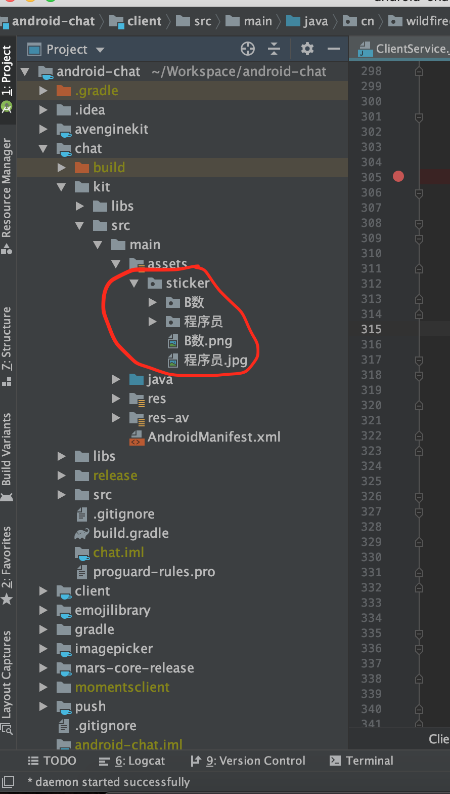

# 小表情大世界
这里的所说的表情就是动态表情，相信大家一定不会陌生，很多人都是斗图达人。虽然动态表情看似简单，但却是IM中十分添彩的一部分。做好动态表情对于一个IM来说非常重要。

## 动态表情有什么用
1. 动态表情可以用来挣钱 表情是门很大的生意，养活了一大批公司，具体就不细讲了，可以参[考媒体报道](http://www.sohu.com/a/161408212_123023) 。

2. 动态表情可能增强用户体验 丰富有趣的内置动态表情和方便的自定义表情能极大地提高聊天的乐趣，促进用户的使用体验，增强用户的粘性。从而增加IM的商业价值，毕竟只有有用户的IM才是好的IM。

3. 动态表情可以用来提高公司形象 每当新的大片上映时，表情中总会出现对应的动态表情包，这是为了宣传使用。野火IM大多数情况下是为客户私有部署的，如果在IM中添加专门为客户定制的专属表情，相信能够极大地提供公司的形象，提高客户特别是领导的付费意愿。

## 那么野火IM中怎么做呢
我想依次说一下这几个问题，表情的来源、野火IM的表情实现细节、如何添加内置表情、如何添加用户收藏功能和自定义表情、最后是如何开发表情商店。

#### 表情来源

相信这篇文章的读者大多数都是程序员吧，缺少艺术细胞一直是我们程序员的一个痛点，毕竟理性和感性是一对矛盾体。野火IM的作者也是一样，当初也是为了表情掉了好多根头发。特别强调一点是一定要注意知识产权，不能随便拿来一个应用解压取出表情包，或者从网上没有确定版权就直接下载使用。这里给大家推荐一个gif网站[soogif](https://www.soogif.com)，可能国内还有很多同类型的，大家可以在上面需要自己中意的表情。然后就是网上有一些斗图包，里面很多都是完全没有版权的，也可以使用。需要注意里面有些使用人物头像的（避免肖像权），还有侮辱粗口色情等少儿不宜的都要去掉。然后就是表情定制，可以使用客户的一些素材从网上找一些设计师，定制一批表情，毕竟优秀的表情从免费资源里找不太容易，还是花钱的更靠谱一些，当然公司有设计师就更好了。如果大家有更好的渠道可以给我们留言。

#### 野火IM的表情实现细节
如果要对野火IM的表情进行二次开发，必须掌握实现细节。iOS和Android的实现方法是一样的，如果你有iOS和Android工程师，遇到问题客户互相商量，下面说明中就不针对某一平台。项目资源目录下有表情资源的文件夹，里面的组织方式是每个表情包都是一个缩略图和文件夹，二者要有相同的名字，表情资源文件夹下可以有多个表情包，平铺在文件夹下。当系统启动时，会判断表情资源文件夹是否都已经copy到软件内部空间，如果有新加的，则会copy到软件内入存储空间。在进入到聊天界面时，会初始化表情，会遍历内部空间的表情包，展示出来。

#### 添加内置表情
一个表情包需要一个缩略图和一组动态表情，缩略图和表情文件夹保持相同名称，然后放到项目的表情资源文件夹中，启动程序就能看到新添加的表情了。如果要删除已经发布的动态表情包，则清除掉项目中的资源，另外需要在代码中添加删除对应表情包的操作。

#### 收藏表情和自定义表情
仅有内置动态表情是不够的，自定义表情和收藏表情更能提高用户使用体验，我们来看看怎么实现吧。

1. 添加内置表情，只不过动态表情只有一个+号图表，应用第一次启动copy到应用内部空间，这样打开表情就会多一个tab，显示+号。

2. 当收藏时，把对应的表情保存在内部空间的收藏表情目录。

3. 当点击收藏区域表情时，需要判断是不是+号，如果是加号，进入到自制表情的流程，表情选择或者制作完成后保存在收藏表情目录。

这样用户就能保存别人发送的表情和自己添加表情，就能愉快地跟朋友们斗图了。

等等，这里面有问题，当用户换手机时，所有的收藏表情都会清零，辛辛苦苦收集的表情不翼而飞，用户一定会急眼的，别着急，我们继续往下说。

这时就需要应用服务出场了，当用户收藏表情时，除了把表情添加到表情目录，另外上传到应用服务，保存下来。当用户更换了手机时，判断本地不存在的表情，后台下载表情到表情目录，这样用户的表情再也不用担心丢失了。

#### 表情商店
可能有些朋友看到这里已经明白，表情商店已经呼之欲出了，毕竟能够同步收藏，再进一步就能实现表情商店了。表情服务为每位用户保存收藏的表情，另外维护表情包（CURD），用户可以添加或者删除表情包，客户端跟表情商店同步就行了。

## 结束语
小表情，大世界，希望这篇文章能够帮助你给你的用户带来更好的体验。
