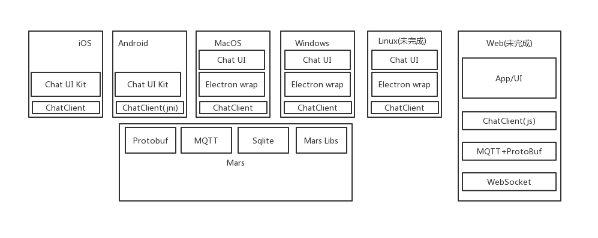
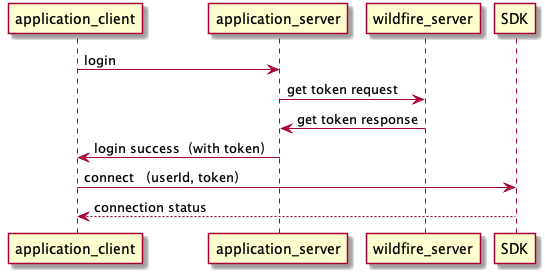
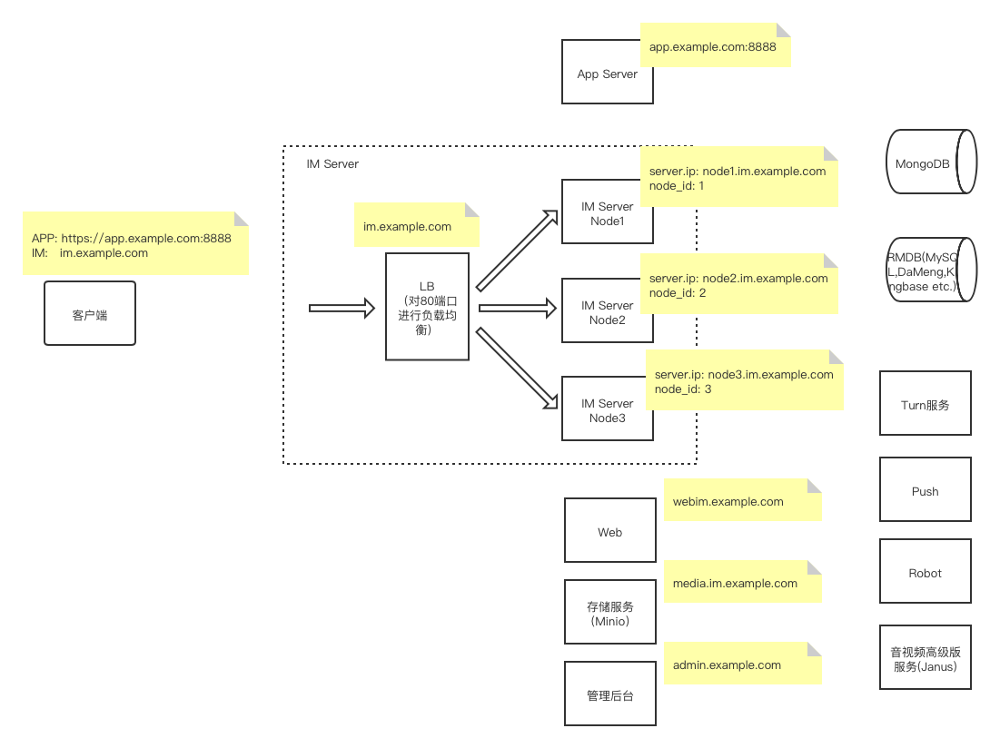

# 系统架构
野火IM除了提供基础IM功能外，还提供群组托管/用户信息托管/好友关系托管等功能，其中用户信息托管和好友关系托管为可选功能，客户可以自己处理用户信息和好友关系，仅仅使用im和群组托管能力。也可以把用户信息和好友关系导入到野火IM中去，SDK和UI更容易使用。

## SDK
SDK分为2部分，一部分是功能SDK，负责所有能力的实现，后文中简称ChatClient，只需要调用connect，传入用户Id和token，ChatClient会自动做好连接/重连、消息同步、群组关系同步、用户信息同步、好友关系同步等。移动客户端和PC客户端使用微信Mars和自定义协议实现，使用C++实现具有跨平台功能。Web客户端使用自定义协议和websocket实现。另外一部分是UI的SDK，实现了常用的UI界面，方便客户集成使用，后文中使用简称ChatUI。
 

## 应用服务器
应用服务器需要处理用户注册/用户登录等业务。应用服务器在用户登陆时去野火IM服务器换取token，然后返回给客户端。我们提供有[Demo](https://github.com/wildfirechat/app_server)供参考。

## 野火IM服务器
负责IM业务的处理，负责群组业务的处理，负责用户信息于好友关系的处理。

## 应用客户端
应用客户端，使用sdk，负责im的UI展示。野火IM提供一个简单的demo，可以作为一个聊天客户端直接使用，也可以移植聊天相关的UI到客户应用中去。

## 推送
野火IM会把需要推送的信息发送到推送服务器，推送服务器推送信息到APNS/华为推送/小米推送等。其中android平台有推送SDK。推送服务是开源的，点击[推送服务](https://github.com/wildfirechat/push_server)查看

## 机器人服务
可以在野火IM服务中添加机器人角色，然后所有发给机器人的消息都会发送到指定的服务，处理后可以用过IM服务发回去。在我们的demo中有个“小火”的机器人，可以单聊或在群里@。我们提供有[Demo](https://github.com/wildfirechat/robot_server)供参考。

## 频道服务（未完成)
频道是有点类似与微信中的公众号功能，用户可以订阅，然后频道主可以发送消息给所有订阅用户。可以部署频道服务来处理类似微信公众号的功能。

## 流程图
#### 登录
  * 登录
  

#### 注册用户
  * 托管用户信息

  

  * 不托管用户信息
  注册时不用同步用户信息到野火IM服务器，获取token不依赖必须存在用户信息。

## 开源代码列表
  * [server](https://github.com/wildfirechat/server)  IM服务源码
  * [android-chat](https://github.com/wildfirechat/android-chat) Android SDK及demo应用源码
  * [ios-chat](https://github.com/wildfirechat/ios-chat) iOS SDK及demo应用源码
  * [pc-chat](https://github.com/wildfirechat/pc-chat) PC客户端源码
  * [app_server](https://github.com/wildfirechat/app_server) 应用服务源码
  * [push_server](https://github.com/wildfirechat/push_server) 推送服务源码
  * [robot_server](https://github.com/wildfirechat/robot_server) 机器人服务源码
  * [docs](https://github.com/wildfirechat/docs/tree/master/md) 文档源码
> 其中IM服务成熟稳定，是可用于商业化的，如果有问题，请提issue或者PR。push需要集成更多的手机厂商的推送服务。其它的两个服务app/robot是配合IM服务的，往往跟您的业务关系比较大，所以是demo级别的，你可以参考来集成您的业务。
> 客户端中sdk（imclient/imuikit）稳定性比较高，建议您直接使用，有问题提issue或PR。应用部分往往跟您的业务密切相关，因此应用是demo级别的，您可以参考demo进行集成。

## 专业版拓扑图

> 野火IM专业版最多支持64个实例。负载均衡的压力非常小，客户端绝大部分请求会直接落到具体的IM服务实例上。
