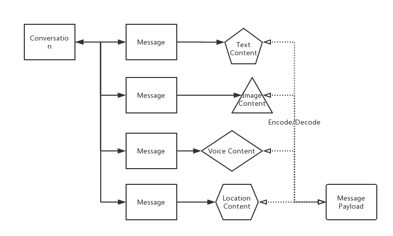

# 会话
#### 会话
会话(Conversation)是指与特定对象聊天消息(Message)的集合，概念与微信中的会话一致，一条一条显示在消息界面中。会话具有如下三个属性
##### 会话类型(ConversationType)：
会话类型存在以下4种：

| 会话类型 | 值 | 意义 |
| ------- | --- | --- |
| Single   | 0   |一对一的会话类型。聊天双方分别为两个用户和个体|
| Group   | 1   |群组会话类型，发送在这个会话的消息会分发到所有的群成员|
| Chatroom   | 2   |聊天室会话类型，发送到这个会话的消息会分发到所有的聊天室成员。与群组的区别在于群组是有离线消息和推送，聊天室的关系是临时的，退出来就不会收到消息|
| Channel   | 3   |一对多的会话类型。频道主可以广播消息，也可以跟受众单独私聊。功能接近于Telegram的频道功能，有点类似于微信公众号|

> 在Android平台参考ConversationType枚举。在iOS平台参考WFCCConversationType枚举。使用server api时使用对应的int值。


##### 会话目标(Target)：
  跟会话类型不同而不同，Single类型时，目标为对方用户Id；Group类型时，目标为群Id；Chatroom类型时，目标为聊天室Id；Channel类型时 目标为Channel ID。

##### 会话线路(Line)：
  会话线路可以更加方便的过滤会话。比如同一个app中不同部门可以使用不同的line区分。或者可以设计不同的场景使用不同的line等。如果没有这种特殊需求，使用0值就可以。

除此之外，还有别的一些属性比如未读数/最后一条消息/更新时间/是否置顶等属性。详情请在客户端源码中查看```Conversation```和```ConversationInfo```对象

#### 会话/消息/消息内容的关系

一个会话会拥有多个消息，每个消息都属于一个会话；每个消息都拥有一个消息内容，消息内容可以有多种形式，比如文本消息内容、图片消息内容等内置消息类型，另外支持自定义消息内容；消息内容在存储或者网络传输中要Encode为消息负载，从数据库中读取或者网络收到消息负载需要Decode为具体的消息内容。
