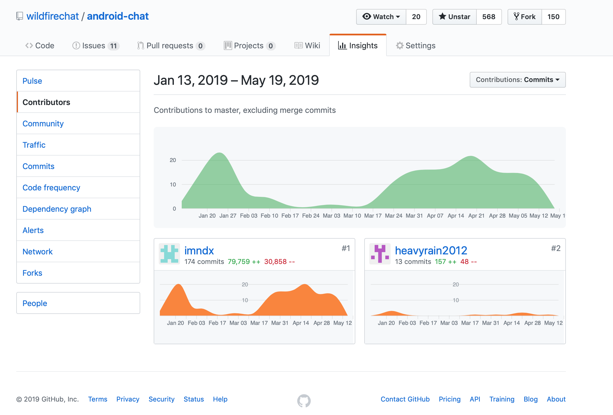

# 维护说明
任何一个有价值的开源产品都在不断的迭代升级，对于野火IM也是一样，只要有大量的客户在使用用，我们就会不断地迭代升级优化，除非是没有价值了我们才会停止维护。由于我们做的是一个通用性产品，所以每个客户使用时都会需要修改来满足自己的业务。这样就会有一个冲突，我们迭代的代码如何与客户自己修改的代码的合并，如果没有一个良好的规范，未来代码的合并和可维护性会越来越麻烦。本章将说明如何进行修改，来降低未来的维护的难度。
> 举个栗子：我们之前有个非常重要的客户，由于客户特殊性，他们索要源码我们就给了。在我们明确建议过的情况下，他们还是在我们的代码中各种魔改添加大量复杂的业务逻辑。但他们主营不是IM业务，既没有人专业的IM人才，也没有足够的精力。就这样过了好几年，他们的代码已经严重落伍了，后来他们需要最新的功能及优化，但已经跟我们维护的代码完全分裂，根本无法进行合并。最后是他们对自己的业务进行了重构，然后在我们指导下基于我们最新的版本进行了业务对接，花费快半年多的时间，另外花费了大量的人力/财力，是个非常深刻的教训。

## 当作中间件来使用
各位肯定使用过mysql/redis之类的开源软件，但肯定很少有人去改动编译后使用的。对于野火IM的正确使用方式也是一样：***当作一个中间件来使用，使用api来对接野火IM的服务，而不是在野火内部修改***。保持野火IM的不变，除了可以无缝的跟随我们升级，另外也为您以后业务发展壮大后需要使用高可靠的商业版成为了可能。商业版每套只有几万块钱，如果您达到需要使用高可靠的商业版时，费用问题就不再是个问题了。
> 如果缺少api导致无法完成某项IM的工作，请联系我们，正当需求我们会添加的。

## 分层对待
野火IM的移动端是分层的，从下到上分别是IMClient，IMUIKit，客户应用。对于IMClient，完全不建议客户自己修改。对于IMUIKit可以自己修改，通用部分给我们提PR。对于客户应用那就不在我们维护的范围之内也不会冲突。

## 给我们提PR
自己辛辛苦苦开发出来的代码为啥要贡献给野火IM？其实贡献PR是件利人利己的事情。
  1. 首先当贡献自己的代码给野火IM后，意味着您的代码与野火IM的代码差异减少，意味着以后合并代码可能会更容易，您贡献的越多以后合并就越容易，当前可能觉得自己修改的这几处跟野火IM的差异是可控的，但随机时间的推移和业务复杂度的增加，差异会越来越大的。
  2. 贡献PR在开源社区是有回报的，PR接受之后在github的提交历史上将永远保留，例如下图。我们目标是打造最流行的IM开源系统，如果目标达成将会是一个非常有影响力的开源社区。您的提交记录对您的个人形象和公司形象非常有帮助。将会有很多人通过这个舞台认识到您，对您以后的工作发展或者公司业务发展都有所帮助。如果贡献大的公司和个人，我们可以列到贡献者名单当中放到显著位置。
 

## 等待我们修改
对于通用性的问题，最好的办法就是提issue，然后等待我们添加或者修改。可以是Bug，也可以是通用性的功能需求。当然简单容易的问题，如果你们比较紧急也可以自己修改，并提PR。

## 修改源码做好标记
修改源码时做好标记是个好习惯，这样当合并代码时很容易分期是我们的代码，还是您自己修改的代码。

## 总结
| 模块 | 功能说明 | 修改 | 提PR | 其它建议 |
| ---- | ------ | -------------- | ------------- | ------- |
| IM Server | IM服务 | 否  | 否 | 是IM的核心服务，不要改动，所有的跟业务对接都通过API进行 |
| APP Server | 应用服务 | 是  | 是 | 是个demo级别的服务，主要是演示如何获取token之类功能，客户一般是不需要使用这个服务，只需要把必要的功能移植到自己的应用服务即可，如果没有自己的应用服务，也可以直接使用。如果发现有问题也可以给我们提PR。 |
| Push Server | 推送服务 | 是  | 是 | IM系统中非常重要的服务，当手机IM断开时，需要靠推送来通知客户，没有推送服务的IM是不完整的。客户可以修改，并建议给我们提PR |
| Robot Server | 机器人服务 | 是  | 是 | 是个demo级别的服务，主要是演示如何利用机器人接口，一般是客户自己的业务逻辑，一般情况下不需要给我们提PR |
| Channel Server | 频道服务 | 是  | 是 | 是个demo级别的服务，主要演示频道的对接能力，客户可以使用作为类微信公众号后台的功能，一般是客户自己的业务逻辑。 |
| IMClient | IM客户端 | 否  | 否 | IM的客户端，里面也涉及到专业的IM知识，不建议客户修改。 |
| IMUIKit | IM UI组件库 | 是  | 是 | 客户为了与自己的风格保持一致，可能需要修改。如果是问题或者通用界面，建议给我们提PR |
| WildFireChat | Demo APP | 是  | 是 | 一般是客户有自己的APP，也可以基于我们直接修改，如果基于我们使用的，如果发现问题可以给我们提PR |
| PC-Chat | Demo Desktop APP | 是  | 是 | 桌面端应用，使用的是electron，建议客户基于我们使用的，如果发现问题可以给我们提PR |
> 以上为建议，客户可以根据自己的情况自由选择。
