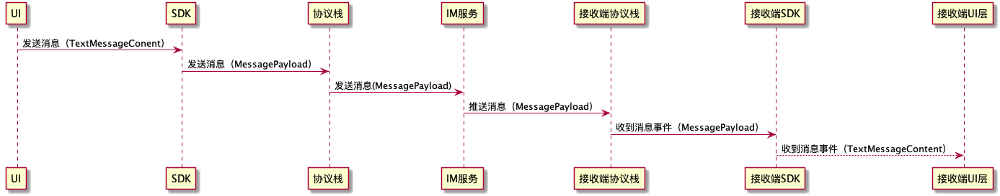

# 消息内容
消息内容(Message Content)是消息中最重要的部分，在网络传输中，消息内容会转化为消息负载(Message Payload)，接收到消息负载后会转化为消息内容。消息内容有一个共同的抽象基类MessageContent。各种消息类型都派生与此基类。此外客户也可以自定义消息内容，继承基类，然后调用sdk的注册消息函数即可（注意必须在连接之前注册）。


在SDK中，会处理消息内容和消息负载的转换。在SDK之上都是使用具体的消息内容，比如文本消息内容、图片消息内容等；在SDK之下，包括协议栈和IM服务都是使用MessagePayload，并不知道具体属于那个消息内容。

Android：
```
public abstract class MessageContent implements Parcelable {
    public abstract MessagePayload encode();
    public abstract void decode(MessagePayload payload);
    public abstract String digest();

    // 自定义消息，必须包含一个无参构造函数
    public MessageContent() {
    }

    public int getType() {
        ContentTag tag = getClass().getAnnotation(ContentTag.class);
        if(tag != null) {
            return tag.type();
        }
        return -1;
    }

    public PersistFlag getPersistFlag() {
        ContentTag tag = getClass().getAnnotation(ContentTag.class);
        if(tag != null) {
            return tag.flag();
        }
        return PersistFlag.No_Persist;
    }
}
```
iOS：
```
@protocol WFCCMessageContent <NSObject>

/**
 消息编码

 @return 消息的持久化内容
 */
- (WFCCMessagePayload *)encode;

/**
 消息解码

 @param payload 消息的持久化内容
 */
- (void)decode:(WFCCMessagePayload *)payload;

/**
 消息类型，必须全局唯一。1000及以下为系统内置类型，自定义消息需要使用1000以上。

 @return 消息类型的唯一值
 */
+ (int)getContentType;

/**
 消息的存储策略

 @return 存储策略
 */
+ (int)getContentFlags;

/**
 消息的简短信息

 @return 消息的简短信息，主要用于通知提示和会话列表等需要简略信息的地方。
 */
- (NSString *)digest;

@end
```

## Server API
通过server api发送/获取消息和IM消息回调，没有包含的消息内容，包含的是消息负载，详情请参考[消息负载](./message_payload.md)。

## 消息类型
消息分成2大类
1. 普通消息
普通消息是可靠的，一定会发送到对方的，在服务器会保存到数据库，普通消息又分为3中类型：
  1. 不存储消息。这类消息在客户端是不存储的，发送和接收方都不会存储。PersistFlag为不存储类型（No_Persist）。在UI上也不会显示出来。
  2. 存储消息。这类消息在客户端会存储，但不做未读计数，PersistFlag为存储类型（Persist）。存储的消息需要处理UI上的显示。
  3. 存储消息。这类消息在客户端会存储，且接收方做未读数计数，PersistFlag为存储计数类型（Persist_And_Count）。存储的消息需要处理UI上的显示。
2. 透传消息
这类消息是不可靠的。如果对方在线就发送过去。如果不在线就直接丢弃。在服务器和客户端都不存储。设置PersistFlag为透传类型。UI上也不会显示出来。
