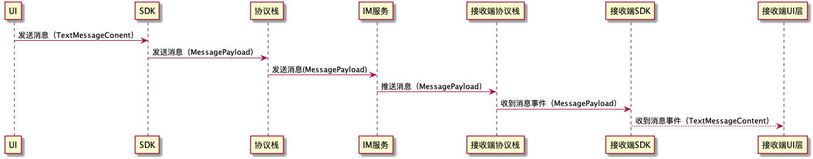

# 消息负载
消息内容需要在网络上传输或本地存储，而消息内容是复杂多变的，因此消息发送过程中先encode为消息负载；消息接收后由消息负载decode为对应的消息内容。在数据库从存取也是如此。



在SDK中，会处理消息内容和消息负载的转换。在SDK之上都是使用具体的消息内容，比如文本消息内容、图片消息内容等；在SDK之下，包括协议栈和IM服务都是使用MessagePayload，并不知道具体属于那个消息内容。

```
public class MessagePayload {

    public int type;//ios平台上是contentType

    public String searchableContent;
    public String pushContent;
    public String pushData;
    public String content;
    public byte[] binaryContent;
    public String extra;

    public int mentionedType;
    public List<String> mentionedTargets;


    public MessageContentMediaType mediaType;
    public String remoteMediaUrl;


    //前面的属性都会在网络发送，下面的属性只在本地存储
    public String localMediaPath;

    //前面的属性都会在网络发送，下面的属性只在本地存储
    public String localContent;
}
```

#### Server API
通过server api发送/获取消息及IM服务回调消息时，消息内容都是MessagePayload，MessagePayload与客户端完全一致（客户端的payload有个二进制属性，api使用的是经过base64编码的）。服务处理时需要注意跟客户端保持一致，比如服务器想发送图片消息，则需要检查一下客户端中图片消息encode的payload格式：设置payload的消息类型为3，remoteUrl为图片的地址（图片需要先上传到对象存储服务得到这个链接），mediaType为图片类型，basedBinaryContent为图片缩略图数据的base64编码。这样发送这个payload到客户端就能正确转化为图片消息。其他消息以此类推。

#### type(contentType)
消息内容类型，根据该类型decode成对应的消息内容。系统内置了如下消息类型，也可以添加自定义消息：

| 内容类型 | 值 | 说明 |
| ------- | --------- | ----------- |
| MESSAGE_CONTENT_TYPE_UNKNOWN | 0 | 未知消息内容 |
| MESSAGE_CONTENT_TYPE_TEXT | 1 | 文本消息内容 |
| MESSAGE_CONTENT_TYPE_SOUND | 2| 语音消息内容 |
| MESSAGE_CONTENT_TYPE_IMAGE | 3| 图片消息内容 |
| MESSAGE_CONTENT_TYPE_LOCATION | 4| 位置消息内容 |
| MESSAGE_CONTENT_TYPE_FILE | 5| 文件消息内容 |
| MESSAGE_CONTENT_TYPE_VIDEO | 6| 视频消息内容 |
| MESSAGE_CONTENT_TYPE_STICKER | 7| 动态表情消息内容 |
| MESSAGE_CONTENT_TYPE_IMAGETEXT | 8| 图文消息混排内容 |
| MESSAGE_CONTENT_TYPE_P_TEXT | 9 | 不计数的文本消息 |
| MESSAGE_CONTENT_TYPE_CARD | 10 | 名片消息内容 |
| MESSAGE_CONTENT_TYPE_COMPOSITE_MESSAGE | 11 | 组合消息 |
| MESSAGE_CONTENT_TYPE_RICH_NOTIFICATION | 12 | 富通知消息 |
| MESSAGE_CONTENT_TYPE_ARTICLES | 13 | 文章消息 |
| MESSAGE_CONTENT_TYPE_STREAMING_TEXT_GENERATING | 14 | 流式消息正在生成消息 |
| MESSAGE_CONTENT_TYPE_STREAMING_TEXT_GENERATED | 15 | 流式消息生成消息 |
| MESSAGE_CONTENT_NOT_DELIVERED | 16 | 消息未送达 |
| MESSAGE_CONTENT_TYPE_PTT_VOICE | 23 | 对讲语音消息 |
| MESSAGE_CONTENT_TYPE_MARK_UNREAD_SYNC | 31 | 标记未读同步消息 |
| MESSAGE_CONTENT_TYPE_CREATE_SECRET_CHAT | 40 | 密聊创建通知 |
| MESSAGE_CONTENT_TYPE_ACCEPT_SECRET_CHAT | 41 | 密聊接受通知 |
| MESSAGE_CONTENT_TYPE_DESTROY_SECRET_CHAT | 42 | 密聊销毁通知 |
| MESSAGE_CONTENT_TYPE_SECRET_CHAT_MESSAGE | 43 | 密聊消息内容 |
| MESSAGE_CONTENT_TYPE_BURN_MSG_READED | 46 | 阅后即焚消息已读 |
| MESSAGE_CONTENT_TYPE_BURN_MSG_PLAYED | 47 | 阅后即焚消息已播放 |
| MESSAGE_CONTENT_TYPE_ENTER_CHANNEL_CHAT | 71 | 进入频道通知消息 |
| MESSAGE_CONTENT_TYPE_LEAVE_CHANNEL_CHAT | 72 | 离开频道通知消息 |
| MESSAGE_CONTENT_TYPE_CHANNEL_MENU_EVENT | 73 | 点击频道菜单事件 |
| MESSAGE_CONTENT_TYPE_RECALL | 80| 撤回消息内容 |
| MESSAGE_CONTENT_TYPE_DELETE | 81 | 删除消息 |
| MESSAGE_CONTENT_TYPE_TIP | 90| 提醒消息内容 |
| MESSAGE_CONTENT_TYPE_TYPING | 91| 正在输入提醒消息内容 |
| MESSAGE_FRIEND_GREETING | 92 | 添加好友问候内容 |
| MESSAGE_FRIEND_ADDED_NOTIFICATION | 93 | 好友已添加通知 |
| MESSAGE_PC_LOGIN_REQUSET | 94 | PC或者Web客户端登录请求 |
| MESSAGE_CONTENT_TYPE_CREATE_GROUP | 104| 创建群组消息内容 |
| MESSAGE_CONTENT_TYPE_ADD_GROUP_MEMBER | 105| 添加群组成员 |
| MESSAGE_CONTENT_TYPE_KICKOF_GROUP_MEMBER | 106| 移出群组成员 |
| MESSAGE_CONTENT_TYPE_QUIT_GROUP | 107| 退出群组 |
| MESSAGE_CONTENT_TYPE_DISMISS_GROUP | 108| 解散群组 |
| MESSAGE_CONTENT_TYPE_TRANSFER_GROUP_OWNER | 109| 转让群组 |
| MESSAGE_CONTENT_TYPE_CHANGE_GROUP_NAME | 110| 修改群组名称 |
| MESSAGE_CONTENT_TYPE_MODIFY_GROUP_ALIAS | 111| 修改群昵称 |
| MESSAGE_CONTENT_TYPE_CHANGE_GROUP_PORTRAIT | 112| 修改群头像 |
| MESSAGE_CONTENT_TYPE_CHANGE_MUTE | 113| 群组禁言状态变化通知 |
| MESSAGE_CONTENT_TYPE_CHANGE_JOINTYPE | 114| 群组加入方法变化通知 |
| MESSAGE_CONTENT_TYPE_CHANGE_PRIVATECHAT | 115| 群组允许私聊状态变化通知 |
| MESSAGE_CONTENT_TYPE_CHANGE_SEARCHABLE | 116| 群组是否可以被搜索状态变化通知 |
| MESSAGE_CONTENT_TYPE_SET_MANAGER | 117| 群组管理员设置通知 |
| MESSAGE_CONTENT_TYPE_MUTE_MEMBER | 118| 群组成员禁言通知 |
| MESSAGE_CONTENT_TYPE_ALLOW_MEMBER | 119| 群组成员添加白名单通知 |
| MESSAGE_CONTENT_TYPE_KICKOF_GROUP_MEMBER_VISIBLE_NOTIFICATION | 120| 移出群成员可见通知 |
| MESSAGE_CONTENT_TYPE_QUIT_GROUP_VISIBLE_NOTIFICATION | 121| 退出群可见通知 |
| MESSAGE_CONTENT_TYPE_MODIFY_GROUP_EXTRA | 122| 修改群组Extra通知 |
| MESSAGE_CONTENT_TYPE_MODIFY_GROUP_MEMBER_EXTRA | 123| 修改群成员Extra通知 |
| MESSAGE_CONTENT_TYPE_MODIFY_GROUP_SETTINGS | 124| 修改群设置通知 |
| VOIP_CONTENT_TYPE_START | 400| 网络电话发起 |
| VOIP_CONTENT_TYPE_END | 402| 网络电话结束 |
| VOIP_CONTENT_TYPE_ACCEPT | 401| 网络电话接听|
| VOIP_CONTENT_TYPE_SIGNAL | 403| 网络电话信令 |
| VOIP_CONTENT_TYPE_MODIFY | 404| 网络电话变更 |
| VOIP_CONTENT_TYPE_ADD_PARTICIPANT | 406| 添加新的参与者 |
| VOIP_CONTENT_MUTE_VIDEO | 407| 视频mute状态变化通知 |
| VOIP_CONTENT_CONFERENCE_INVITE | 408| 会议邀请通知 |
| VOIP_CONTENT_CONFERENCE_CHANGE_MODE | 410| 会议模式变化通知 |
| VOIP_CONTENT_CONFERENCE_KICKOFF_MEMBER | 411| 会议移出成员通知 |
| VOIP_CONTENT_CONFERENCE_COMMAND | 412| 会议命令消息 |
| VOIP_CONTENT_MULTI_CALL_ONGOING | 416| 群组通话正在进行通知 |
| VOIP_CONTENT_JOIN_CALL_REQUEST | 417| 请求加入群组通话通知  |

>  野火IM支持自定义消息内容，type请使用1000以上


#### searchableContent
可搜索内容，用于本地搜索或者在服务器搜索

#### pushContent
对于自定义消息，如果需要推送需要encode此字段。推送内容会使用此字段。此字段会显示在用户手机推送内容区。

#### pushData
对于自定义消息，如果需要推送需要encode此字段。推送内容会使用此字段。此字段不显示在推送内容中，但可以作为推送点击之后的数据。比如内容为订单号，点击打开对应订单。

#### binaryContent;
二进制内容。在server api或者server sdk中，这个字段是做base64编码传输的，字段名为base64edData。

#### mentionedType
提醒类型（就是@某人或@全体）。0 不提醒；1 对mentionedTargets里的user进行提醒；2 对群内所有人提醒。

#### mediaType
媒体类型，媒体消息内容使用，用来区别在服务器端文件对应的bucket。

#### remoteMediaUrl
媒体类消息的远程地址。

#### local****
本地使用内容，不会在网络发送。比如媒体文件下载下来需要记录路径，或者本地处理过需要标记一些内容等。
