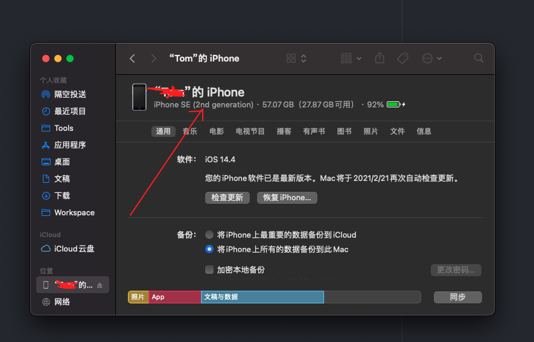

# iOS下如何抓网络包
1. 确保在mac上装有tcpdump工具，一般默认都会安装，在命令行下执行命令:```tcpdump -h```，看到帮助信息就说明有这个工具。
2. 找到手机的UUID，把手机连上电脑，然后打开 “访达（finder）” 找到手机，然后点击下图箭头位置(默认不显示UUID，必须点击一下才显示)，切换到显示UUID的界面后，拷贝下图中画红线的UUID备用。

3. 在终端窗口输入如下命令，注意UUID换成步骤2拷贝的内容
```
rvictl -s UUID
```
就会出现提示```Starting device UUID [SUCCEEDED] with interface rvi0```，最后的```rvi0```为虚拟出来的网卡。
4. 在终端窗口输入命令：
```
sudo tcpdump -i rvi0 -w hello.pcap
```
5. 复现问题，然后Ctrl+c 断开，把文件发给我们分析就行了。
