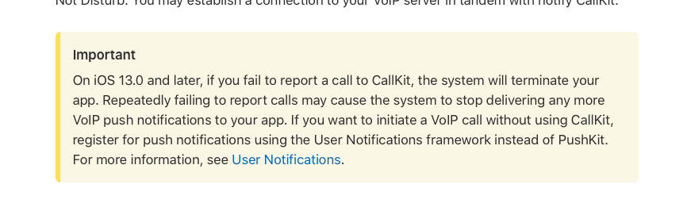

# iOS音视频通知的处理
iOS有着严格的后台活动限制，因为应用大多时候都应该在后台非活跃状态下，所以音视频的推送是非常影响体验的工作，需要仔细处理才能既符合苹果的政策，又能够及时地提示用户来电。

## 苹果推荐做法
苹果最推荐的做法就是使用pushkit和callkit。这两个相信做iOS开发的小伙伴都非常熟悉了，简而言之就是pushkit的voip推送可以让你的应用在冻结或者杀死状态下变成活跃状态，能够连上IM并且收到音视频来电的回调，收到回调之后就可以调用callkit，在不打开应用的情况下显示来电画面和响铃。这种做法可以达到最佳的通话体验，基本能够接近手机的原生电话功能。

但callkit功能在国内因为政策的原因是不能使用的，因此需要想别的办法实现音视频的推送。

## 变通方法
既然不让用callkit，那我就使用pushkit得了，应用收到voip推送后就变成活跃的了，收到来电回调后，本地弹出通知。在电话挂断时，取消掉弹出的通知，这样虽然没有callkit的那样好，但有铃声和通知也能比较好的告知用户来电了。但这还是一条不归路，因为苹果不让这么用。。。


> 苹果禁止只使用pushkit不使用callit，来源链接 https://developer.apple.com/documentation/pushkit/pkpushregistrydelegate/2875784-pushregistry?language=objc 。

## 使用普通通知总可以了吧
既然这不行，那不行，那咱们就改成普通通知吧。把推送类型从voip改成alert，这样应用不启动的情况下，会弹出一个通知栏，可以自定义铃声，当voip推送时，铃声换成来电铃声。来电完美解决！

但是当挂断电话时的问题就来了，来电的铃声会一直响到播放完，体验太差了，即使指定一个通话结束的铃声，也无法结束前面的铃声。此方案行不通

## 后台通知方案
首先介绍一下苹果推送的常见几种类型，上面已经提到过一部分了
1. alert，通知直接弹出一个通知栏，程序不能启动。问题是无法结束通知。
2. voip，拉活应用，可以做任何事，但苹果仅限制搭配callkit使用，国内无法使用。
3. background，有回调函数可以响应，仅在回调函数内做部分轻量任务。

还有其它的推送类型就不介绍了，已经有可以用的推送类型了，就是background推送。当客户端收到后可以根据是来电还是结束来弹出通知和结束通知。

下面我们看看怎么来修改：

1. 服务器端：需要更新到最新的推送服务，注意配置文件关闭掉voip推送开关，代码中已经修改了voip走background推送及payload中添加了voip信息。
2. 客户端：客户端在appdelegate中添加```application:didReceiveRemoteNotification:fetchCompletionHandler```方法，并在方法中判断推送是不是voip推送，来弹出来电通知或取消来电通知。可以参考我们demo中的实现。

但在我们实际应用中，这种方案效果并不好，因为backgroud模式的优先级太低，不能及时响应，所以这种方法也不太可行。

## 到底怎么处理？
到底怎么处理比较好我们也不清楚，还是留给客户自己根据自己的情况来处理吧。另外也要及时关注相关政策的变化，如果苹果要是允许只使用pushkit，或者国内允许使用callkit，那就不是问题了。据我们部分客户反应，只使用pushkit苹果也没有处理，我们也没有渠道来证实，您可以关注一下相关政策。

## 如何处理国内国外同时存在的情况
如果只在国外pushkit+callkit就好了，如果只在国内要考虑国内的办法。但如果同时支持国内和国外怎么办？这种情况下需要在推送服务来区分处理，需要对推送服务进行改造，来判断用户用那种方式（比如客户上传自己的位置等）。
