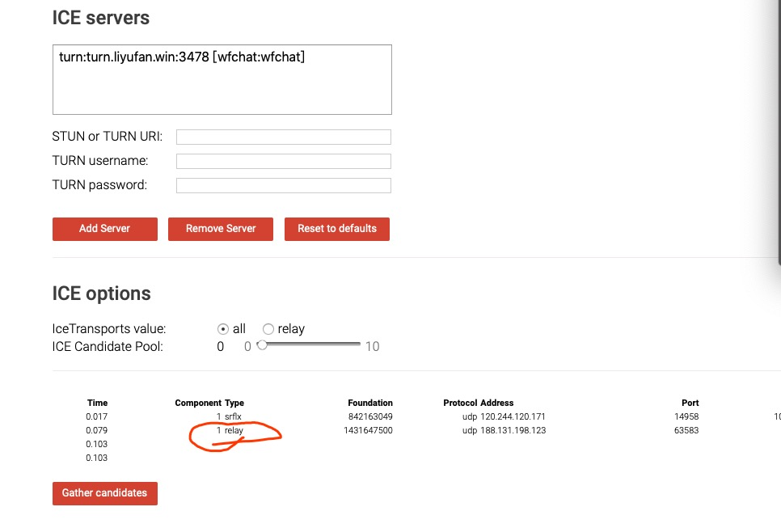

# 使用 Docker 启动 TURN 服务

## 常用的 TURN 服务器镜像

### 1. coturn（最常用）

coturn 是目前最流行的开源 TURN/STUN 服务器实现。

```bash
# 拉取镜像
docker pull coturn/coturn
```

### 2. 使用配置文件启动

首先创建配置文件 `turnserver.conf`：

```conf
# TURN 服务器配置
listening-port=3478
listening-ip=内网IP
relay-ip=内网IP
external-ip=公网IP

# 或创建用户
user=username:password

# 日志设置
verbose
log-file=/var/log/turnserver.log

# 安全设置
no-multicast-peers
```
> 把配置文件中的**内网IP**换成实际的内网IP，把**公网IP**替换成实际的外网IP。也有云服务只有一个公网IP，这里都用公网IP。也有那种大局域网，公网IP要填写局域网内的“公网IP”，也就是所有客户端能够直连的IP地址。

启动命令：

```bash
docker run -d --name coturn \
  -p 3478:3478 \
  -p 3478:3478/udp \
  -p 49152-65535:49152-65535/udp \
  -v $(pwd)/turnserver.conf:/etc/coturn/turnserver.conf \
  coturn/coturn
```

## 关键配置说明

| 参数 | 说明 |
|------|------|
| listening-port | TURN 监听端口（默认 3478） |
| relay-ip | 本机的内网IP |
| external-ip | 公网 IP |
| user | 静态用户名密码 |

## 验证 TURN 服务
使用[这个链接](https://docs.wildfirechat.cn/webrtc/trickle-ice/)检查turn服务是否部署成功。***注意一定要是turn服务，不能是stun服务，一定要出现下图中红线标注的type***。


> 当Type为"relay"且后面的地址为您的公网IP时，表明turn服务部署成功，否则为失败。

## 防火墙注意事项

确保开放以下端口：

- **TCP/UDP 3478**：标准 TURN 端口
- **UDP 49152-65535**：中继端口范围（可配置）

## 与野火音视频配合使用

野火音视频服务支持配置 TURN 服务器，用于在复杂网络环境下进行媒体中继。在野火音视频高级版中，可以通过配置文件指定 TURN 服务器地址和认证信息，确保 P2P 连接失败时能够自动切换到 TURN 中继模式。
