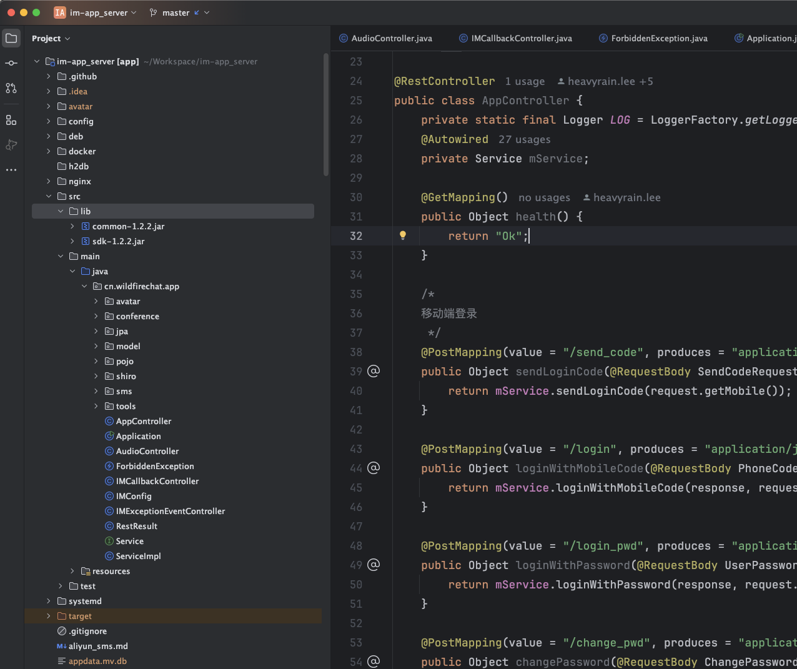
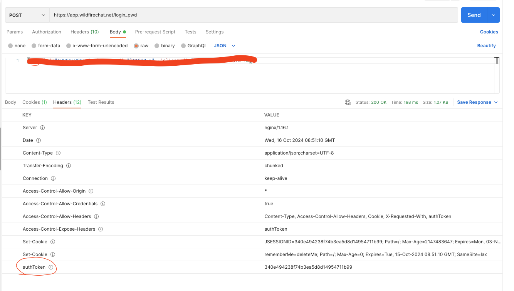

# 应用服务的一些细节问题

## 什么是应用服务？
应用服务是野火IM系统中一个周边服务。IM服务是整个IM系统的核心，处理所有的消息群组长连接等业务。但IM服务不包括用户的登录，这个登录功能就是放到应用服务中的。IM服务与登录功能分离的好处是方便IM服务与其他系统继续集成及开发客户自己需要的登录方式。除了登录之外，还包括一些其他的业务功能。所有功能包括如下：
1. 短信验证码登录
2. 密码验证/重置密码
3. PC/Web扫码登录
4. 收藏
5. 群公告
6. 生成群组头像
7. 会议管理
8. 客户端的一些接口，比如获取投诉、上传日志、API发送消息等
9. IM服务异常回调
10. IM服务各种回调的示例
11. 小程序语言消息转换

这个服务的所有代码都是开源的，所里理论上客户要自己维护这个服务，实际上如果客户有自己的业务系统，可以把这个服务上的。这里会简单介绍一点常见的问题。

## 目录介绍

1. config目录，存放应用的配置文件。
2. docker目录，存储dockerfile文件，可以把应用打包成docker镜像。
3. nginx目录，存放nginx的示例配置。
4. lib目录，存放野火IMSDK。
5. cn.wildfirechat.app包下的avatar目录，用户客户端拼接头像的功能，包括生成用户默认头像和拼接群组头像。
6. conference目录，野火会议控制代码。
7. jpa目录，数据库相关。
8. model目录，应用服务用到的数据模型。
9. pojo目录，输入输出的数据接口。
10. shiro目录，认证控制。
11. sms目录，短信验证相关。
12. AppController文件，大部分应用服务功能，包括短信验证/扫码登录/密码登录/收藏/群公告等。
13. AudioController文件，给小程序使用的，用来把其他平台发送的amr语音文件转为mp3文件。
14. IMCallbackController文件，接受IM服务的回调，用来延时如何解析回调数据。
15. IMExceptionEventController文件，当IM服务有异常出现时，回调用这个接口，可以开发监控功能。

## 认证相关的
有很多接口需要认证用户身份的，比如收藏，比如扫码登录等。因为这个服务使用了shiro作为认证工具。需要对shiro有一定的了解才行。如果对shiro不了解请先在网上学习一下shiro的相关知识。

```ShiroConfig```类中```shiroFilter```方法里，规定了哪些方法是匿名的，哪些方法是需要认证的。在```securityManager```方法中定义了3个realm，分别对应了号码登录、密码登录和扫码登录三种方式。

客户端在登录成功之后，在登录成功的响应中会有个authToken的header，这个认证的令牌，所有需要认证的接口都需要在token中带上这个令牌。


当客户端登录成功以后要保管好这个authToken，之后所有的应用服务的接口都需要在header中带上这个authToken。

## 扫码登录
### 扫码的流程：
1. PC/Web客户端从SDK获取到clientId之后，调用应用服务的```/pc_session```接口，创建一个登录的session。
2. PC/Web客户端在页面上显示一个二维码，二维码的内容为：```wildfirechat://pcsession/{sessionid}```。
3. PC/Web客户端长轮询应用服务的```/session_login/{sessionid}```接口，尝试登录，等待移动端的扫码确认。
4. 移动端扫描二维码显示确认登录界面，同时调用应用服务的```/scan_pc/{sessionid}```接口。
5. 应用服务把session的状态更新为已扫描，步骤3的长轮询就会返回状态给PC/Web客户端，这样PC/Web客户端会显示为已扫描。PC/Web客户端继续长轮询。
6. 移动客户端点击确认登录，调用应用服务的```/confirm_pc```，body中带有sessionid。
7. 应用服务把session的状态改为已经确认。长轮询检查已经确认就会认为已经登录成功，会从IM服务获取IM token，并返回给PC/Web客户端。
8. PC/Web客户端拿到自己的用户ID和IM Token，登录工作完成。后续调用SDK的connect来链接IM服务。
