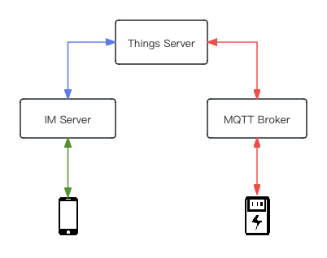

# 物联网设备的接入
野火IM可以连接人与人、连接人与服务。那么野火IM能不能连接人与物联网设备呢？答案当然是肯定的，下面咱们看一下怎么来实现。

## 什么是物联网设备
首先要定义什么是物联网设备，我们简单下个定义就是操作系统为RTOS或者无操作系统且能联网的设备。这个定义包括的范围非常广（可能比正常理解的物联网设备概念要广），形态差异也非常大，但他们都有一个共同的特点就是提供直接或者间接的MQTT客户端功能，能够连接到MQTT Broker上。

## 方案的选择
最早野火针对物联网设备做过一个方案，因为野火的IM服务是基于MQTT服务进行二开的，简单改造物联网的MQTT客户端和IM服务，就可以让物联网直接连上IM服务。所以现在还能看到这些痕迹，比如会话类型有个Things类型，消息有个ThingsMessage。但我们很快就发现问题，物联网的系统差异太大了甚至有些没有系统，导致物联网客户端没有办法做到通用；另外野火IM服务虽然是基于MQTT修改的，但逻辑已经完全修改，不能发挥物联网设备使用MQTT的能力。最终我们放弃了这个方案。

现在我们推荐的方案是写一个业务服务来作为人和物联网设备的桥梁，人和业务服务通过IM的机器人建立连接，物联网设备和业务服务通过MQTT建立连接，如下图所示:

## 人和服务的连接
人和业务服务的连接就不赘述了，可以通过机器人的方式建立人和服务的双向沟通，具体方法请参考[《如何正确地理解机器人》](如何正确地理解机器人.md)。

## 设备和业务服务的连接
MQTT是物联网的标准服务，所有的设备都支持MQTT的接入。业务服务可以集成MQTT客户端来接入到MQTT服务。这样业务服务和设备分别发布主题和订阅主题就可以双向沟通了。

#物联网业务服务
我们把这个负责中转和兼做一些业务的服务称之为物联网业务服务，后面简称业务服务。这个服务负责双方协议的转换和一些业务的处理。假设物联网设备是一个儿童的电话手表，是RTOS系统且带有4/5G模块（相比一智能手表，RTOS的手表可以有非常长的待机，可能充满一次电使用超过一周的时间）。用户端为家长的手机。当儿童想要给家长发送一条语音消息时：
1. 儿童按下录音按钮说话，当说完后放开，手表发布一个上行语音Topic。
2. 业务服务订阅上行语音Topic，收到手表发布的语音消息。检查此手表绑定的家长用户信息，调用野火IM的server SDK给这名用户发送一条野火IM的语音消息。
3. 家长手机收到发送来的消息，听完之后，家长录音回复语音消息。
4. IM服务把语音消息转发到业务服务，业务服务检查此家长对应的手表信息，把野火IM的语音消息转化为MQTT消息发不到下行语音Topic进行发布。
5. 手表订阅了下行语音的Topic，收下来语音后进行播放。

至此就完成了家长（用户）与儿童（物联网设备）的双向沟通。可以通过类似这种方法来接入任何物联网设备和实现这些设备的业务。
