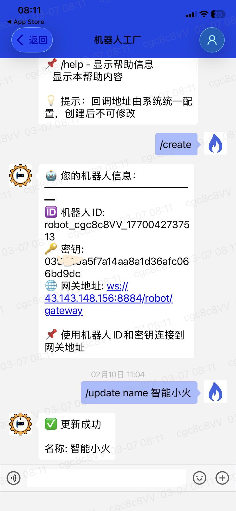
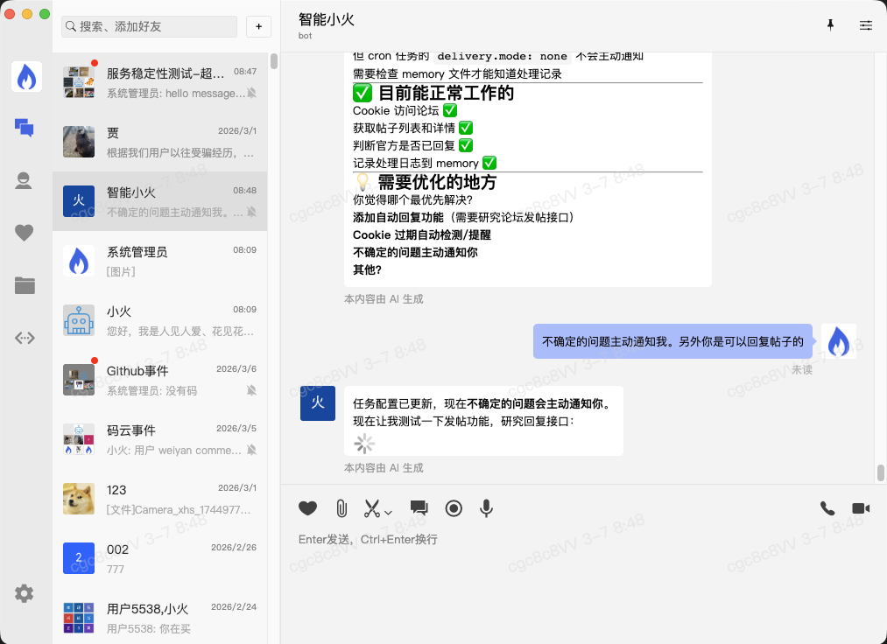

# 野火IM × OpenClaw：打造你的私有化AI助手

> 从零开始，用野火IM打造一个24小时在线的个人AI助手

## 前言

2026年初，一个名为 **OpenClaw**（小龙虾）的开源项目席卷GitHub，成为开源史上增长最快的AI项目之一。这个被称为"数字员工"的AI助手，能够通过你日常使用的聊天软件——飞书、钉钉、Telegram、WhatsApp 等——帮你写代码、查资料、管理文件、控制智能家居……

但有一个问题：OpenClaw原生支持的多是海外IM平台，国内用户想要接入钉钉、飞书等，往往需要复杂的开发工作，还需要购买云服务，还面临各种使用限制。

这时候，**野火IM** 登场了。

作为国内领先的开源IM解决方案，野火IM不仅提供了完整的即时通讯能力，更推出了创新的**机器人工厂**和**内网穿透SDK**，让你无需复杂的服务器配置，就能在本地电脑上运行OpenClaw，并通过野火IM机器人与其交互。

本文将手把手带你完成整个对接流程，让你也能拥有一个"私有化部署的AI助手"。

---

## 第一部分：OpenClaw 简介与安装

### 什么是 OpenClaw？

OpenClaw 是一个**自托管的个人AI助手网关**，它的核心理念是：

- **本地优先**：Gateway 运行在你自己的设备上，数据不出本机
- **多通道接入**：一个AI助手，同时服务多个聊天平台
- **执行而不只是聊天**：能直接操作电脑、运行代码、管理文件

架构上，OpenClaw 采用**单 Gateway + 多渠道 + Pi 嵌入式 Agent** 的设计：

```
用户消息 → IM平台 → OpenClaw Gateway → AI Agent → 执行结果 → 回复用户
                ↑___________________________________________|
```

### 安装 OpenClaw

安装非常简单，只需三步：

**1. 全局安装 OpenClaw**

```bash
npm install -g openclaw@latest
```

> 要求：Node.js ≥ 22

**2. 初始化配置**

```bash
openclaw onboard --install-daemon
```

这一步会引导你完成：
- 选择模型提供商（推荐 Minimax M2.1 或 Claude）
- 输入 API Key
- 配置网关端口（默认 18789）
- 生成网关 Token（后面会用到，也可在 `~/.openclaw/openclaw.json` 中查看）

**3. 获取网关 Token**

OpenClaw 配置完成后，Token 会保存在 `~/.openclaw/openclaw.json` 文件中：

```bash
cat ~/.openclaw/openclaw.json | grep token
```

或者在 JSON 文件中查看：
```json
{
  "gateway": {
    "token": "你的网关Token"
  }
}
```

**4. 启动网关服务**

```bash
openclaw gateway --port 18789 --verbose
```

看到 `Gateway running` 字样，说明启动成功！此时 OpenClaw 正在监听 `ws://127.0.0.1:18789`，等待连接。

---

## 第二部分：申请野火IM机器人账号

这是整个方案最有特色的部分。野火IM提供了类似 Telegram BotFather 的**机器人工厂**功能，让你非常容易地创建自己的机器人。

### 步骤一：下载野火IM客户端

1. 访问 [野火IM官网](https://www.wildfirechat.cn) 或扫描官网二维码下载客户端
2. 支持 iOS、Android、PC（Windows/Mac/Linux）、Web、小程序全平台

### 步骤二：找到机器人工厂

1. 注册并登录野火IM账号
2. 在搜索框中输入 **"robotfather"**
3. 添加机器人工厂为好友

### 步骤三：创建你的专属机器人

与机器人工厂的对话中，使用以下命令：

| 命令 | 说明 |
|------|------|
| `/help` | 显示帮助信息 |
| `/create` | 创建机器人（或获取已有机器人信息） |
| `/info` | 查看当前机器人详细信息 |
| `/list` | 列出你拥有的所有机器人 |
| `/delete` | 删除当前机器人 |
| `/update name <名称>` | 更新机器人的显示名称 |
| `/update portrait <URL>` | 更新机器人头像URL |

> 💡 **提示**：回调地址由系统统一配置，创建后不可修改

**创建流程示例：**

1. 发送 `/create`
2. 系统会自动为你分配 **机器人ID** 和 **密钥**：
   - 机器人ID：`robot_xxxxx_xxxxxxxxxxxx`
   - 密钥：`xxxxxxxxxxxxxxxx`
   - 网关地址：`ws://xxx.xxx.xxx.xxx:8884/robot/gateway`

   如下图所示：

   

3. 使用 `/update name <名称>` 可以修改机器人的显示名称，例如：
   ```
   /update name 智能小火
   ```

4. 请妥善保存 **机器人ID** 和 **密钥**，后面配置适配器时需要用到

```
机器人创建成功！
- 机器人ID: my_ai_assistant
- 密钥: xxxxxxxx-xxxx-xxxx-xxxx-xxxxxxxxxxxx
```

### 步骤四：部署 Robot Gateway（网关服务）

野火IM的机器人通常需要部署在服务器上接收回调，但为了让大家能在本地电脑上运行，野火团队开发了**内网穿透机器人SDK**。

你需要部署一个 `robot-gateway` 服务作为中转：
- 野火IM服务 ←→ HTTP → Robot Gateway ←→ WebSocket → 本地 Adapter

> 🔗 **Robot Gateway 源码及部署文档**：https://gitee.com/wfchat/robot-gateway

默认会启动在 `8884` 端口。部署完成后，你的 OpenClaw 就能跑在本地电脑、家用NAS，甚至是内网服务器上了。

---

## 第三部分：运行野火IM OpenClaw 插件

现在我们进入核心环节——启动桥接适配器，让野火IM和OpenClaw能够"对话"。

### 安装适配器

```bash
npm install -g @wildfirechat/openclaw-adapter
```

### 配置参数

首次运行会自动创建配置目录 `~/.wf-openclaw-adapter/`，你需要编辑 `config.json`：

```json
{
  "wildfire": {
    "gateway": {
      "url": "ws://localhost:8884/robot/gateway",
      "robotId": "你的机器人ID",
      "robotSecret": "你的机器人密钥"
    }
  },
  "openclaw": {
    "gateway": {
      "url": "ws://127.0.0.1:18789",
      "token": "你的OpenClaw Token",
      "scope": "wildfire-im",
      "reconnectInterval": 5000,
      "heartbeatInterval": 30000
    },
    "whitelist": {
      "enabled": true,
      "allowedUsers": ["your_user_id"],
      "allowedGroups": []
    },
    "group": {
      "enabled": true,
      "respondOnMention": true,
      "respondOnQuestion": true,
      "helpKeywords": "帮,请,分析,总结,怎么,如何",
      "allowedIds": []
    }
  },
  "server": {
    "port": 8080
  }
}
```

**配置说明：**

| 配置项 | 说明 | 获取方式 |
|--------|------|----------|
| `wildfire.gateway.robotId` | 野火机器人ID | 机器人工厂创建时返回 |
| `wildfire.gateway.robotSecret` | 野火机器人密钥 | 机器人工厂创建时返回 |
| `openclaw.gateway.token` | OpenClaw网关Token | `~/.openclaw/openclaw.json` 中查看 |

#### 获取你的用户ID并配置白名单

机器人的ID格式为：`robot_{ownerId}_timestamp`，例如：`robot_cgc8c8VV_1770042737513`

其中 **`{ownerId}` 部分（即 `cgc8c8VV`）就是你的用户ID**。

**获取方法：**
1. 在机器人工厂中发送 `/info` 查看机器人信息
2. 从机器人ID中提取 `ownerId` 部分

**配置到白名单：**

将获取到的用户ID填入配置文件的 `allowedUsers` 列表中：

```json
{
  "openclaw": {
    "whitelist": {
      "enabled": true,
      "allowedUsers": ["cgc8c8VV"],
      "allowedGroups": []
    }
  }
}
```

> 💡 **提示**：
> - 可以添加多个用户ID，让亲友也能使用你的AI助手
> - 也可以添加群组ID到 `allowedGroups`，让整个群组都能使用
> - 如果要开放给所有人使用，可将 `enabled` 设为 `false` 关闭白名单

### 启动适配器

**前台运行（调试模式）：**

```bash
openclaw-adapter
# 或使用别名
wf-openclaw
```

**后台守护进程模式（生产环境）：**

```bash
# 启动
openclaw-adapter start

# 查看状态
openclaw-adapter status

# 停止
openclaw-adapter stop

# 重启
openclaw-adapter restart
```

启动成功后，你会看到如下输出：

```
╔════════════════════════════════════════════════════════╗
║        Openclaw Adapter - 野火IM/Openclaw桥接器         ║
║                     Version 1.0.3                      ║
╚════════════════════════════════════════════════════════╝

Connecting to Wildfire Gateway: ws://localhost:8884/robot/gateway
Connected to Wildfire Gateway as robot: my_ai_assistant
Connecting to Openclaw Gateway: ws://127.0.0.1:18789
Openclaw Gateway connection authenticated successfully
Openclaw Bridge started successfully

Adapter is running. Press Ctrl+C to stop.
```

### 验证连接

打开浏览器或使用 curl 检查健康状态：

```bash
curl http://localhost:8080/health
```

返回：
```json
{
  "status": "UP",
  "components": {
    "wildfire": { "status": "UP", "details": { "connected": true } },
    "openclaw": { "status": "UP", "details": { "connected": true } }
  }
}
```

### 开始使用

现在，打开野火IM客户端，找到你的机器人（搜索机器人ID），开始对话吧！

**私聊模式**：直接发送消息，AI会立即回复

**群聊模式**：
- @机器人提问
- 或者消息以问号结尾
- 或者包含"帮"、"分析"、"总结"等关键词

---

## 实际效果展示

下图展示了野火IM与OpenClaw配合工作的实际效果。用户发送问题后，AI助手（智能小火）会即时响应，支持多轮对话和复杂任务处理：



可以看到，整个交互体验非常流畅自然，就像与真人对话一样。

---

## 第四部分：野火IM方案的独特优势

### 与其他IM平台的对比

目前国内主流的 OpenClaw 接入方式主要有飞书、钉钉、企业微信等。但这些平台普遍存在一定的使用限制，而野火IM的方案则在灵活性、安全性和可控性方面展现出独特优势（下面的数据都是从公开信息里查到的，如果有误，请以官方信息为准）。

#### 飞书的限制

飞书是 OpenClaw 官方支持的渠道之一，但使用过程中存在以下限制：

| 限制类型 | 具体说明 |
|----------|----------|
| **API调用额度** | 免费版每月仅400-20,000次（新开通30天内20,000次，之后每月400次） |
| **频率限制** | 标准版20QPS，超过即限流 |
| **配置复杂** | 需创建企业自建应用、配置权限、事件订阅、发布审核 |
| **配对授权** | 首次使用需配对码授权 |
| **插件问题** | 官方插件曾存在兼容性问题 |

> 参考：飞书开放平台公告显示，免费版权益有限时升级活动，但基础限制仍然存在。

#### 钉钉的限制

钉钉机器人也存在明显的使用门槛：

| 限制类型 | 具体说明 |
|----------|----------|
| **API调用量** | 标准版每月仅10,000次 |
| **消息频控** | 每分钟最多20条，超限限流10分钟 |
| **服务器要求** | 需要公网服务器部署 |
| **版本要求** | 专业版（9800元/年）才能提升额度至50万次/月 |

---

### 野火IM的六大核心优势

#### 1. 完全私有部署，数据自主可控

野火IM及机器人网关均支持**完全私有部署**：
- IM服务部署在自己的服务器
- 机器人网关可部署在公网或内网
- 所有消息数据不出自己的环境
- 符合企业数据合规要求

相比之下，飞书、钉钉都是公有云服务，消息需要经过第三方服务器。

#### 2. 本地运行，无需云服务器

野火IM的**内网穿透机器人SDK**让你可以把 OpenClaw 跑在：
- 本地开发机
- 家用NAS
- 内网服务器
- 甚至笔记本电脑

通过 Robot Gateway 的中转，即使在内网环境也能稳定接收消息。而飞书、钉钉的接入方案则必须要有公网服务器。

#### 3. 无频率和功能限制

野火IM机器人**没有API调用限制**：
- 无每月调用次数上限
- 无QPS频率限制
- 无消息发送条数限制
- 群聊、私聊、文件传输等功能全开

这对于高频使用的AI助手场景至关重要。想象一下，团队群聊中@AI助手进行讨论，如果突然因为"本月额度已用完"而停止响应，体验将大打折扣。

#### 4. 完全开源，便于二次开发

野火IM的整个方案都是开源的：
- Robot Gateway 开源（https://gitee.com/wfchat/robot-gateway）
- OpenClaw 适配器开源（npm: @wildfirechat/openclaw-adapter）
- 野火IM社区版开源
- 野火Android/iOS客户端开源

你可以：
- 自定义消息处理逻辑
- 扩展新的消息类型支持
- 对接内部业务系统
- 修改群聊策略规则

而飞书、钉钉的机器人开发都受限于平台提供的API范围，无法深度定制。

#### 5. 机器人工厂，一键创建

参考 Telegram BotFather 的设计，野火IM提供了可视化的**机器人工厂**：
- 无需写代码
- 无需服务器配置
- 聊天式交互，几条指令完成创建
- 支持创建多个机器人，方便测试和生产环境分离
- 自动分配回调地址，无需手动配置

相比飞书需要创建企业应用、配置权限、发布审核的复杂流程，野火IM的机器人创建体验更加轻量。

#### 6. 企业级IM能力

野火IM本身是一套完整的企业级即时通讯解决方案：
- **全平台支持**：iOS、Android、PC、Web、小程序
- **私有化部署**：可部署在自己的服务器上
- **安全可靠**：端到端加密，符合企业合规要求
- **功能丰富**：消息回执、已读未读、撤回、引用、@提醒
- **智能群聊策略**：@回复、问号回复、关键词回复、白名单等多种策略

这意味着你的AI助手可以无缝融入企业工作流，成为真正的"数字员工"。

---

### 优势对比总结表

| 特性 | 野火IM | 飞书 | 钉钉 |
|------|--------|------|------|
| **私有部署** | ✅ 完全支持 | ❌ 公有云 | ❌ 公有云 |
| **本地运行** | ✅ 支持 | ❌ 需公网服务器 | ❌ 需公网服务器 |
| **API调用限制** | ✅ 无限制 | ❌ 400-20,000次/月 | ❌ 10,000次/月 |
| **频率限制** | ✅ 无限制 | ❌ 20QPS | ❌ 20条/分钟 |
| **开源可定制** | ✅ 完全开源 | ❌ 封闭平台 | ❌ 封闭平台 |
| **创建流程** | ✅ 简单（机器人工厂） | ❌ 复杂（企业应用） | ❌ 较复杂 |
| **消息功能** | ✅ 完整支持 | ✅ 完整支持 | ✅ 完整支持 |
| **成本** | ✅ 开源免费 | ⚠️ 免费额度有限 | ⚠️ 免费额度有限 |

**选择建议：**
- 如果你需要**数据安全可控**、**高频使用**、**深度定制** —— 选择野火IM
- 如果你已经在使用飞书/钉钉办公，且使用量不大 —— 可以选择对应平台
- 如果你希望**长期稳定运行**且**成本可控** —— 野火IM是更优选择

---

## 架构解析

整个系统的数据流如下，按部署位置分为三层：

```
┌─────────────────────────────────────────────────────────────────────────────────────────────┐
│                                          【云端/服务端层】                                    │
│                                                                                             │
│  ┌──────────────┐                              ┌──────────────┐                            │
│  │   野火IM      │◀────────────────────────────▶│ Robot Gateway│                            │
│  │   服务        │                              │  (穿透服务)   │                            │
│  └──────────────┘                              └──────────────┘                            │
│         ▲                                             ▲                                     │
└─────────┼─────────────────────────────────────────────┼─────────────────────────────────────┘
          │                                             │
════════════════════════════════════════════════════════════════════════════════════════════════
          │                                             │
          ▼                                             ▼
┌──────────────────────┐              ┌──────────────────────────────────────────────────────┐
│   【本地 - 用户端】    │              │                    【本地 - AI服务端】                  │
│                      │              │                                                      │
│  ┌─────────────┐     │              │  ┌─────────────────┐                                 │
│  │   野火IM     │     │              │  │  Openclaw       │                                 │
│  │  客户端      │     │              │  │  Adapter        │                                  │
│  └─────────────┘     │              │  └─────────────────┘                                  │
│                      │              │           ▲                                           │
│                      │              │           ▼                                           │
│                      │              │  ┌─────────────────┐                                  │
│                      │              │  │ Openclaw Gateway│                                  │
│                      │              │  │  (ws://127.0.0.1│                                  │
│                      │              │  │    :18789)      │                                  │
│                      │              │  └─────────────────┘                                  │
│                      │              │           ▲                                           │
│                      │              │           ▼                                           │
│                      │              │  ┌─────────────────┐                                  │
│                      │              │  │   Pi Agent      │                                  │
│                      │              │  │  (AI大脑)        │                                  │
│                      │              │  └─────────────────┘                                  │
└──────────────────────┘              └───────────────────────────────────────────────────────┘
```

消息流程：
1. 用户在野火IM客户端发送消息
2. 消息通过野火IM服务接收并处理
3. 野火IM服务将消息推送到 Robot Gateway
4. Robot Gateway 通过 WebSocket 转发到本地 Openclaw Adapter
5. Adapter 转换格式后发送到 Openclaw Gateway
6. Pi Agent（AI大脑）处理并生成回复
7. 回复沿原路返回给用户

---

## 故障排查

### 消息无响应

1. **检查白名单**：确认 `allowedUsers` 中包含你的用户ID
2. **检查群聊策略**：确认是否被@或包含关键词
3. **查看日志**：`tail -f ~/.wf-openclaw-adapter/openclaw-adapter.log`

### 连接失败

1. 确认 Openclaw Gateway 已启动：`openclaw gateway --verbose`
2. 确认 Robot Gateway 已启动：`npm start`（在 gateway 目录）
3. 检查 Token 是否正确配置

### 守护进程问题

```bash
# 手动查找进程
ps aux | grep openclaw-adapter

# 强制停止
kill -9 <PID>
rm ~/.wf-openclaw-adapter/openclaw-adapter.pid
```

---

## 总结

通过本文，我们完成了：

1. ✅ **安装 OpenClaw** —— 你的本地AI助手网关
2. ✅ **申请野火IM机器人** —— 通过机器人工厂一键创建
3. ✅ **部署桥接适配器** —— 打通两个系统的任督二脉
4. ✅ **理解核心优势** —— 内网穿透、企业级能力、智能策略

现在，你已经拥有了一个"私有化AI助手"，它：
- 24小时在线，随时待命
- 数据本地化，隐私无忧
- 支持群聊协作，智能防刷屏
- 可接入企业内部系统，成为真正的"数字员工"

野火IM + OpenClaw 的组合，不仅是技术的融合，更是国产IM能力与全球开源AI生态的完美结合。期待你在此基础上，开发出更多有趣的应用！

---

## 参考资源

| 资源 | 链接 |
|------|------|
| OpenClaw 官网 | https://openclaw.ai |
| OpenClaw GitHub | https://github.com/openclaw/openclaw |
| 野火IM 官网 | https://www.wildfirechat.cn |
| 机器人工厂介绍 | https://mp.weixin.qq.com/s/soKKSEeMvyje1y0qAfc2VQ |
| 本项目仓库 | https://github.com/wildfirechat/robot-gateway |

---

*本文基于 `@wildfirechat/openclaw-adapter` v1.0.3 版本编写，如有更新请以官方文档为准。*
