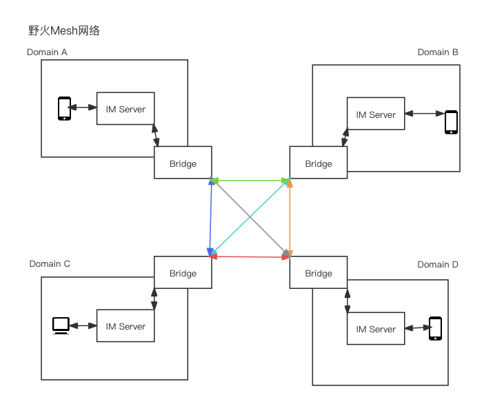

# 野火IM互通方案
一般情况下，一个IM服务都会是一个孤岛，仅限于这个IM服务内的用户之间通讯。在野火的客户里，有很多大型企业或者事业单位，内部有多套隶属于不同部门或者分公司的独立IM服务，他们迫切需要内部的IM之间能够相互打通。

因此野火的小伙伴们针对专业版IM服务开发出了IM服务互通功能，简称Mesh，大概架构如下：

每个IM服务都额外部署一个mesh-bridge服务，这个服务与其他IM域进行互联互通。这样整个Mesh内的用户都可以互通了。

整个系统没有中心节点，但需要有个管理者或者协调者来处理节点的加入还有域ID的分配问题。这样既可以保证内部多个IM之间的互通，又能满足对外的封闭性，确保数据安全。

在客户端的表现上，有点儿类似微信的企业微信，其他企业的用户后面会有标黄的企业名称。

因为专业版IM服务和社区版IM服务交互流程上有不小的区别，暂时无法支持社区版。

如果有购买多套专业版IM服务的用户有需求此功能，需要把IM服务和SDK都升级到2024.7.1之后的版本，然后去Github或者码云上下载mesh-bridge服务部署。码云下载地址点击原文链接就可以看到，Github上有同名的项目。

某些功能做了舍弃，比如在线状态，阅读状态，因为跨网络同步这些信息时非常消耗资源且容易出错。不同IM服务之间的网络延迟也比同一个IM服务内部大好几个数量级，因此性能也会有不小的损耗。
