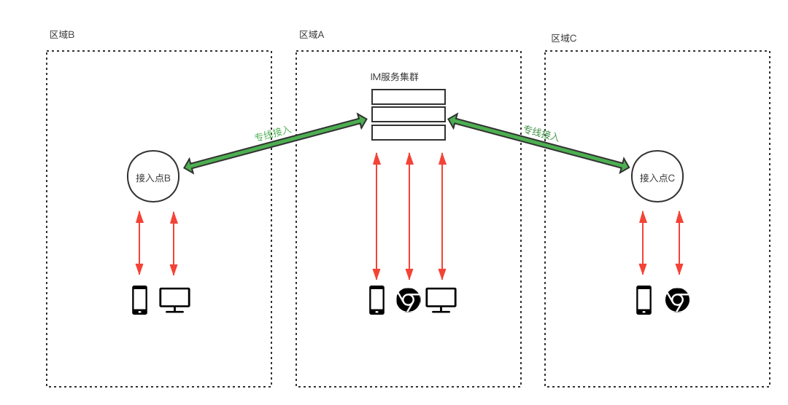
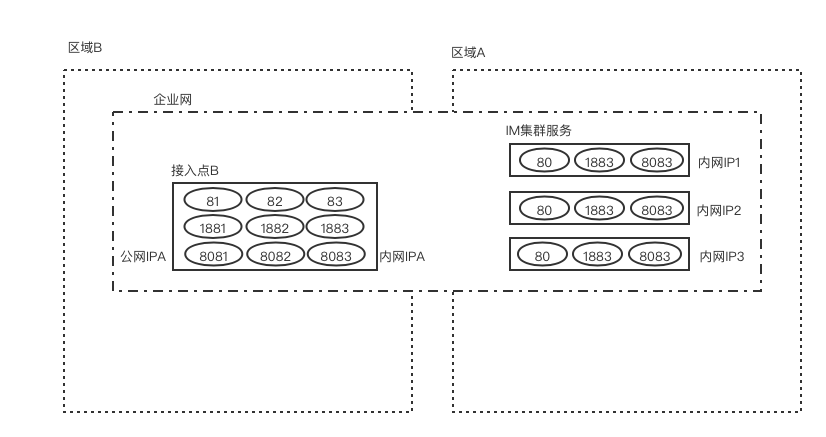

# 野火IM全球接入方案

近年来，随着国内经济的发展，越来越多的企业业务走出国门走向世界。在海外绕不过的一个问题就是基础设施比较落后或者跨区域网络连接不稳定。即时通讯产品对网络质量尤其敏感，因此支持全球接入是出海即时通讯产品的必要条件。全球接入即时通讯产品只有少数几家头部即时通讯企业拥有，且价格非常昂贵，且只有公有云支持，没有办法私有部署，使用的门槛非常高。但好消息是野火也能支持全球接入，使用专业版加上少量资源和简单的运维操作，就能让您的应用具有全球接入能力。现在我们就讲一下怎么处理。

## 全球接入的原理
在之前一遍文章[《政企内外双网解决方案》](./政企内外双网解决方案.md)中讲到，野火可以支持两张网络。把第二张网络信息设置到节点的备选网络中，这样客户端就可以得到多个网络信息，然后再按照一定的策略选择最合适的网络进行连接。如果我们在全球多地部署多个接入点，这样客户端就可以就近连上最近的接入点，而接入点到IM服务之间使用专线（或者类似与专线的方案，确保接入点和IM服务器之间的网络质量就好了），这样客户端就能高质量地接入到IM服务中去。如下图所示：

IM服务集群部署在区域A，这样区域A内的客户端都可以较好地接入到服务中去。但区域B和区域C内的用户无法很好地直接连接到IM服务集群去。在可以在区域B部署接入点B、在区域C部署接入点C，接入点到IM服务集群的网络有保障。这样区域B/C的客户端可以经过接入点B/接入点C连上位于区域A的IM服务集群。

## 野火IM全球接入的实现
野火IM有4部分需要分别处理，服务域名的加速，节点服务的接入点配置，对象存储服务的加速，音视频的加速。下面分别讲一下如何处理

### 服务域名的加速
服务域名也就是客户端配置的IM服务地址、专业版的授权域名。为了使用全球加速，必需使用域名。服务域名的加速很简单，只需要使用CDN的动态加速就可以了。这样当客户端访问服务域名时，会自动走CDN提供商最近的节点，然后回源到您的IM服务去。所有的CDN服务商都可以，注意要选择动态加速确保每次请求都能回源到IM服务。

客户端对服务域名的访问次数很少，不会有很大的访问量，因为客户端访问过服务域名后会直接访问节点服务，不再通过服务域名。

### 节点服务的加速
客户端大部分的交互都是直接跟节点服务进行的，移动客户端和PC客户端会访问节点的HTTP服务（默认是80端口）和TCP服务（默认是1883端口）。Web和小程序客户端会访问节点的WebSocket服务（默认是8083接口）。

如果在区域B部署接入点，首先购买区域B的云服务器，然后再建立此服务与IM集群服务直接的可靠网络。专线是质量最好的，但价格会非常贵，使用云服务器的企业内网服务就可以，确保接入点和IM集群直接有相对可靠的网络就行，ping值和丢包率都比较好就可以了。

购买好硬件资源后，就可以做端口的规划，需要对每个节点的这三个端口做映射。比如您有10台IM服务节点，那么就需要规划10*3=30个端口，与这10台节点的端口一一映射。

使用4层的反向代理服务，可以是LB、LVS或者nginx（支持stream）把接入点的端口映射到IM服务节点去，注意映射1883和8083端口需要会话保持至少10分钟以上。

最后是配置IM服务，在每个节点上，配置备选地址为接入点的IP及映射的端口。

可以参考下图:

通过企业网，把位于区域A的IM服务集群和位于区域B的接入点纳入同一个内网中，可以互通。然后在接入点为每个服务节点的每个端口映射一个端口，如图节点1的80端口映射为接入点的81端口、节点1的1883端口映射为接入点的1881端口、节点1的8083端口映射为接入点的8081接口。节点二、三以此类推，确保端口一一对应。然后在每个IM服务节点上配置自己对应的接入信息，比如节点1对应的配置信息为：
```
## 备选server地址，一般用于内外网隔离的环境，普通用户不要打开
## 以英文逗号分开，格式为{$IP}:{$short_link_port}:{$long_link_port}:{$ws(s)_port}
## 如果没有Web客户端，ws(s)_port可以随意设置一个，但不能空缺。
server.backup_address  IPA:81:1881:8081
```
以此类推，节点二的就是```IPA:82:1882:8082```、节点三的就是```IPA:83:1883:8083```等等。注意以上端口都是示例，可以用这个示例的端口，也可以自己来定义端口。

如果一个接入点到达瓶颈，可以部署多个接入点，确保接入点和节点直接的对应关系就行。

如果有多个区域，也可以部署多个接入点。配置文件中配置好每个接入点的信息以逗号分割开来。

千万要注意的是：客户端是固定落在某个节点上的，落在那个节点是IM服务内部算出来的，不能接入点配置和实际节点不匹配。比如一个接入点信息（IP:port1:port2:port3）实际映射到节点1，然后配置到节点2中，这样是不行的。

### 对象存储服务加速
野火专业版支持七牛和阿里云对象存储，使用他们时开启CDN，然后注意区域范围要选全球，这样他们就能保证上传下载的速度。

野火专业版还支持野火私有对象存储，这个是HTTP的服务，通用也可以走云服务器厂商的CDN进行加速。

### 野火音视频的加速
已经有解决方案，正在测试验证中。

## 野火客户端如何实现
增加全球接入功能，客户端不需要做任何的操作（早期版本需要设置网络策略为0），客户端协议栈自动支持多点接入。客户端的实现其实并不是我们做的，借用一句流行的广告语：“我们不编写代码，我们只是好代码的搬运工！”实现是在微信mars实现的，可以参考[微信终端跨平台组件 Mars 系列（三）连接超时与IP&Port排序](https://mp.weixin.qq.com/s/LGEmNa2qxdjdhy4yY6CN2w)。微信的策略不一定是最好的，但一定是最稳的。
