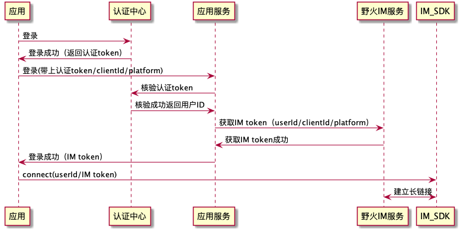

# 野火IM如何做单点登录

如上图所示，从认证中心得到认证token后，再调用应用服务进行登录（也可以改成获取IM token），应用服务把原来核验短信和密码的逻辑改成去认证中心认证，其他的逻辑不变。当客户端得到IM token后，就可以调用SDK的connect方法进行连接了。

在代码层面，应用服务使用了shiro认证，需要对shiro有一定了解才行，需要添加一个新的realm。当然也可以彻底的舍弃掉这个应用服务（我们也是推荐的），使用你们自己的业务服务，只要能够客户端返回IM token就行。
