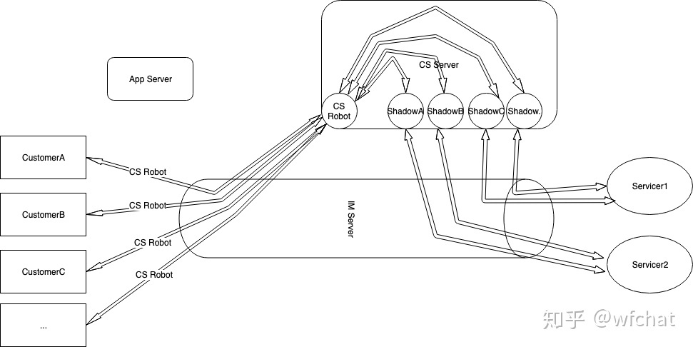

# 野火IM应用之如何做一套客服系统
野火IM提供连接能力，能够连接人与人或者人与服务。一旦人与人或者人与服务建立了连接，则一切想法都有了实现的基础。这里就讲一下如何利用野火IM构建一个客服系统。

客服系统是各行各业广泛存在的系统，基本上您只要有客户就会有客服系统的需求。客服系统是一个庞大行业，养活了一大批专业的企业。客服系统里面的学问很多，专业的客服具有非常复杂的功能，但带来的缺点就是贵，另外就是形式固定单一，很难进行定制话。有种说法一个手机有90%的功能是没有人用的，客户系统也是，其实一个低价直接但可以定制的客服系统更受市场上90%的小企业的欢迎。

本文介绍的内容适合2、3人的开发小团队，可以作为一门生意来做，提供及其有竞争力的客服系统。也适合于有一定开发能力的企业，能够自己定制自己的客服系统。

## 架构图

## 名词解释
CS System：客服系统，能够使客户与客服人员进行沟通的辅助系统，包含上图中的所有的组件和角色。一般具有机器人和分配坐席功能。包括CS Server，IM Server，Customer Client，Servicer Client等。

Customer Client：客户端，使用商家提供的移动端应用或者网页应用，可以点击客服进行咨询活动。后面简称Customer。

Servicer Client：客服坐席端，在特制的应用端或者PC端工作，接收Customer的咨询。后面简称Servicer。

IM Server：野火IM服务器，充当连接角色，连接人（Customer&Servicer）与服务（CS Server）。需要在各个端内嵌野火IM SDK。

App Server：拥有IM系统超级权限的应用服务，可以使用IM Server提供的api做各种操作，这里主要用来创建机器人。

CS Server：客服系统中最重要的系统，在这里实现所有的客服逻辑。拥有一个CS Robot和N个Customer Shadow。

CS Robot：野火IM机器人，系统初始化时创建的一个全局机器人，所有的Customer都与该CS Robot进行沟通。CS Robot转发消息到CS Server。

野火IM机器人：野火IM中一种特殊的用户，具有callback和secret。当收到消息时，会把消息转发到callback指向的服务器。服务器也可以使用robot api和secret代表机器人用户发送消息。

Customer Shadow：用户影子机器人，为每个客户分配一个，跟客户的关系是一一对应的，后面简称Shadow。Servicer与Shadow进行收发消息，Shadow转发收到Servicer的消息到CS Server。

CS Session：服务会话，Customer启动客服即创建Session。Session包括当前模式：是自动应答模式还是人工模式。如果是人工模式，保存有对应的Servicer和Shadow。当前会话的开始时间及idle时间（多久没有消息发送）。

## 处理流程
客服发起流程：

1. 用户在客户端点击客服图标，唤起与CS Robot的聊天窗口，这时发送一条进入消息（不显示属性消息，不会显示在会话窗口）。
2. IM服务转发这条消息到CS Server，后面就不陈述这个动作了，可以把IM Server看作透明管道，用户发送给CS Robot的消息直接发送到CS Server。Servicer发送到Shadow的消息也是透传到CS Server。
3. CS Server收到进入消息后，把欢迎语发送给Customer。这里发送指通过robot api发送消息。这里同样可以把IM server看作透明管道，CS Server发消息给Customer。欢迎语可以是常见问题提示等。
4. Customer发送咨询消息，CS Server检查Session是否存在，如果不存在，创建Session，初始化为自动应答模式。在自动应答模式下，CS Server调用自动应答服务接口返回应答语句，发送给Customer。
5. Customer往复与自动应答模式交流。
6. Customer觉得问题已经解决，关闭聊天窗口，发送退出消息，CS Server收到退出消息后关闭当前session。用户也可能直接离开，CS Server等待超时后，发送结束客服提示给Customer，然后关闭session。
7. Customer觉得自动应答模式无法解决问题，点击转人工按钮发送一条转人工请求。
8. CS Server收到转人工请求后会根据逻辑判断是否可以分配坐席，分配到那个坐席。如果无法分配坐席就发送转人工失败的提示给Customer。
9. 如果可以转人工，CS Server会尝试切换session的模式，首先检查该用户的shadow是否存在。如果不存在，调用App Server进行创建该用户的shadow，该shadow callback指向CS Server。创建shadow后，修改session模式为人工模式，记录下shadow与servicer的对应关系。然后发出分配坐席成功的消息给Servicer，再把用户消息通过Shadow的身份发给Servicer。
10. Servicer回复的消息会发送到CS Server。CS Server根据session找到对应的Shadow，再找到对应的用户id，然后再以CS Robot的身份把消息发给用户。
11. Customer和Servicer通过这种模式进行来回沟通
12. Customer和Servicer可以结束session，也可以通过超时关闭session。

## 其他细节
* Customer和Shadow是一一对应的，对应关系可以简单处理，在用户id的后面加上Shadow。比如用户的ID为"Xc27ba"，对应的Shadow ID为"Xc27ba*Shadow"。也可以使用数据库保存用户与Shadow的对应关系。创建Shadow时也可以使用用户的头像和名字等。
* 坐席需要有开始服务/结束服务功能，通知CS Server当前坐席是否可用。
* 历史聊天记录问题。Servicer需要知道历史聊天记录，可以在CS Server保存所有的聊天记录。然后Server需要查看该用户与客服的聊天记录时，调用CS Server的接口返回该用户与CS Robot的聊天记录。
* 客服服务中的Servicer的角色问题。在野火IM默认的系统中，跟robot聊天界面显示的就是该robot的头像和名称。客服系统中需要显示当前客服的头像和名称。需要改造野火IM客户端，在每条消息的extra中加上当前客服的头像和名字，然后界面显示时从extra中读取头像和名字。
* 客服都需要有评价系统，在Customer结束人工会话时弹出评价界面，对当前客服坐席进行打分。这里就不需要累述了。
* AppServer与CS Server之间需要鉴权，该规则需要开发者自己来定。使用App Server和CS Server分开的模式，可以让第三方来开发CS系统，而不担心有超级权限暴露的风险。如果是一个公司内部开发，安全可信，可以把创建Shadow的功能放到CS Server中去。

以上，一个简单可定制的客服系统就出来了。如果有什么见解，欢迎留言评论。
