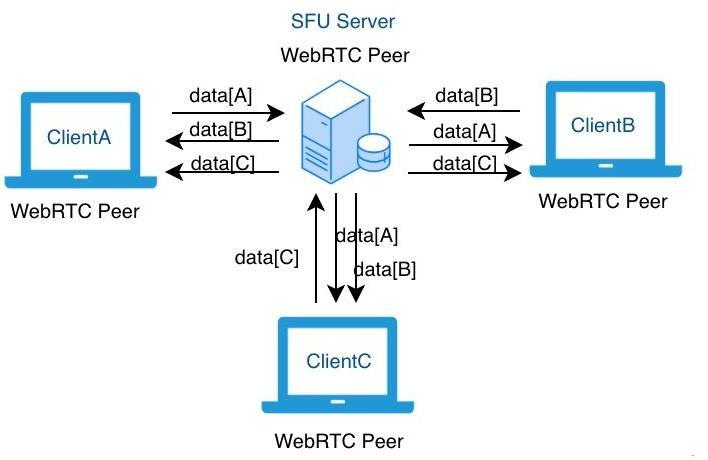
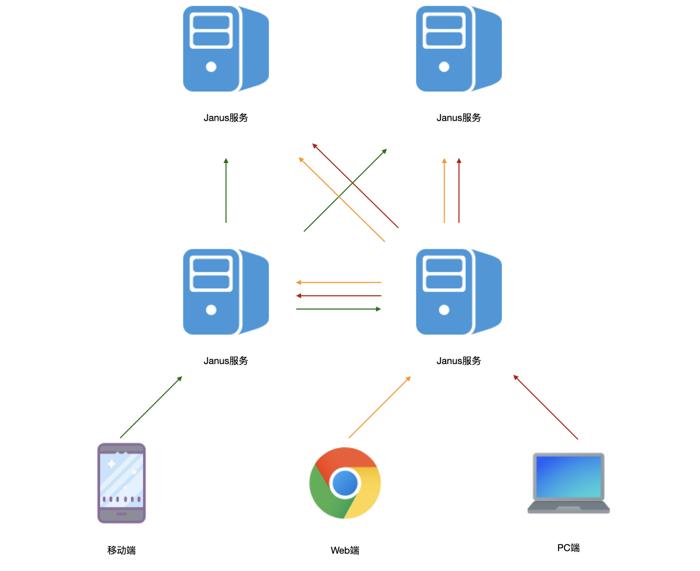

# 野火音视频之超级会议
承接前一篇[《野火音视频简介》](./野火音视频简介.md)介绍了野火多种实时音视频解决方案，本文将进一步介绍野火实时音视频高级版的超级会议。

## SFU的工作原理及限制
野火实时音视频高级版是使用SFU模式的，SFU的介绍网上很多，这里只简单介绍一下，如下图（来源于网络，如果侵权请联系我们删除）所示：

所有客户端推送数据到SFU服务，然后SFU服务把数据流转发到各个客户端。SFU服务仅做转发工作，不做混流，也就是说每个客户端都上行一路，下行N-1路。下行的每一路视频播放压力都比较小，所以能够支持很多路的通话。

在此基础之上，进一步开发出主播/观察者模式，主播发出数据流，也接受其他主播的数据流，观察者只接受主播的数据流，这样就可以做到1个或者多个主播发出数据流，同时多人进行收听收看。

问题就是单个服务器的带宽是有限的，无法支持非常多的用户。有个简单的办法是部署多个实例，这样当有很多小的会议或者视频通话时，就会随机分散到不同的实例上去。野火早期的实时音视频高级版就是这样实现的，但问题是单个音视频通话/单个直播还是有容量上限，不能超过这个实例的带宽上限。

## 超级模式
为解决这个问题，野火实时音视频高级版开发了超级模式，发起会议时可以选择超级模式，当选择超级模式后，如下图：

部署了N个SFU服务，每个主播随机分配到某一台SFU服务上，当前主播推送的数据流到SFU服务器，该SFU服务再把数据流推到其他所有SFU服务上去。每个观察者也都会随机分配到某一台SFU服务上，这样他就可以拉取当前直播所有主播的数据流。由于主播数目是有限的且SFU服务之间都是走内网，基本上SFU服务之间的数据交互没有任何网络压力。而大量的观察者则被平均分配到各个SFU服务上去，这样单个直播的最大容量就是整个系统的容量。您可以水平扩展更多的SFU服务来支撑更大规模的会议或直播。

## 容量计算
一般都是按照路来计算，路数为：主播数M x 观众数N + 主播数M x （主播数M - 1）。比如主播4人，观众100人，则路数为 4 x 100 + 4 x 3 = 412路。如果主播2人，观众1000人，则路数为2 x 1000 + 2 x 1 = 2002路。如果20人视频会议，则路数是20 x 0 + 20 x 19 = 380路。

默认情况下每路带宽800kbps，如果修改码率则需要实际测算一下。一般云服务器最高带宽可达200mbps，这样每台服务器就支持250路。如果需要2000路，则至少需要8台以上的服务。

由于带宽非常贵，而音视频实际上是低频应用，所以按照流量购买是最合适的。而一般情况下不需要大量的服务，可以在需要大会时临时扩容，然后会后再缩容。

注意如果开大会时，服务器的整体流量非常大，如果所有人都在同一个区域，比如一个单位的1000人都在同一栋楼内，带宽也会不足的，需要避免掉这种情况。

## 最后
事实上主流的实时音视频供应商用的都是这个技术，可能有些技术能力强的厂商会有部分优化，但我们认为谷歌已经做的足够好了，很多时候优化没有那么必须甚至是画蛇添足，更多的技术是体现在应用和网络优化方面。技术能力强和运维水平高的客户可以基于我们开发出媲美于zoom和腾讯会议的产品。

欢迎各位客户来使用，让我们一起为社会提供更好用、更强大、更实惠的即时通讯和实时音视频产品！
