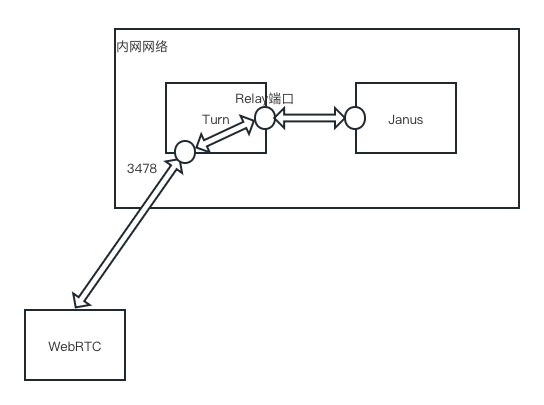

# 音视频高级版的单端口化和强制TCP化
## 什么是单端口化
野火音视频高级版的Janus服务一般是跟客户端直连的，每个客户端都需要至少4个UDP端口，这样为了支撑大量的用户需要开通非常多的UDP端口。在某些信息安全敏感单位，一般开通太多端口是不太现实的（其实这些UDP端口开放也是安全的，但安全规定有限制），这样最好的解决办法是只开一个端口，所有客户端都通过这个端口来连接，解决了这个问题。这个解决办法就是单端口化。单端口化实质上没有带来任何的改变，仅为了满足政策要求，一般无政策要求的，建议不要单端口化。

## 什么是TCP化
野火音视频高级版默认使用UDP，事实上UDP是非常适合流媒体通话的。但有个特殊的情况是当UDP流量较大时，运营商会限制UDP导致通话失败。这种情况下就可以考虑使用TCP，这就是所谓的TCP化。TCP化在网络状况不好时，会导致严重的问题，所以TCP化只能用在***需要大流量高清视频且有网络质量保证的情况下***，其他情况不建议使用。

## 工作原理
从上面看到单端口化和TCP完全不相干，但为什么放到一起来讲呢？因为他们的实现方法是一样的。实现这连个功能都是使用turn服务来中转，客户端通过turn服务来连接janus，这样就可以达到目的。如下图所示：



turn服务和Janus服务部署在同一个内网中，完全互联互通（也可以限定Janus服务配置中的端口）。客户端在通话建立之前，先请求turn服务来分配中继地址，这个中继地址为内网地址，然后跟janus服务建立连接。如图所示：客户端的媒体流会跟3478端口进行交互，turn服务会中继3478与relay端口，janus与relay端口建立UDP连接。

Turn服务可以做到多路复用，因此所有的客户端都是通过3478端口来连接turn服务的，因此防火墙只需要开通TCP3478和UDP3478的权限即可，这样就实现了单端口化。

Turn服务与客户端直接的链接，默认是UDP的，也可以强制为TCP的。当强制TCP时，客户端与turn服务之间是TCP的，turn服务和janus服务之间依然是UDP的。强制方法为在turn服务URI最后加上```?transport=tcp```就这么简单。

## 实现方法
### Janus服务
Janus服务需要按照Janus项目文档进行部署和配置，只有下面几点不同：
1. Janus服务不需要公网资源，可以纯内网环境。
2. DOCKER_IP使用内网IP。
3. Janus与turn服务要完全内网相通，或者在2个服务限定的端口范围内互通。

### Turn服务
Turn服务按照正常流程部署和配置，只有一个地方需要修改，Turn服务配置中的```external-ip```配置为内网IP。通过[这个链接](https://docs.wildfirechat.cn/webrtc/trickle-ice/)确认生成relay的Candidate，且地址为内网IP地址。

### 防火墙
1. Janus服务不用开通任何外网访问权限。
2. Turn服务仅开通3478 TCP和UDP入访权限。
3. Janus与turn服务要完全内网相通，或者在2个服务限定的端口范围内互通。

### 客户端
1. 客户端配置使用Turn服务。
2. 客户端调用音视频SDK的```forceRelay```接口.

### 单端口化
上述步骤实现后，单端口化即完成了。

### TCP化
在单端口化的基础之上，还需要下面客户端的修改实现TCP化。
1. 在Turn服务的URI上加上```?transport=tcp```，比如```turn:110.40.213.119:3478?transport=tcp```。
