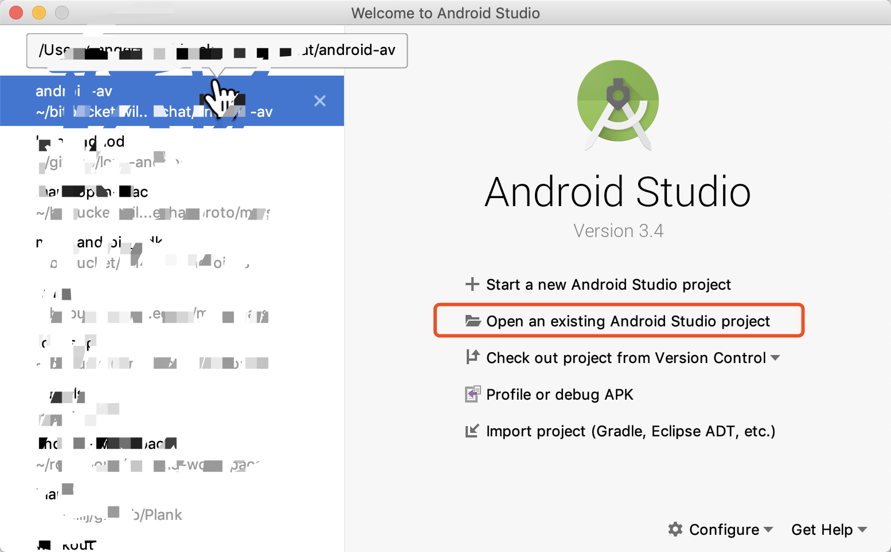
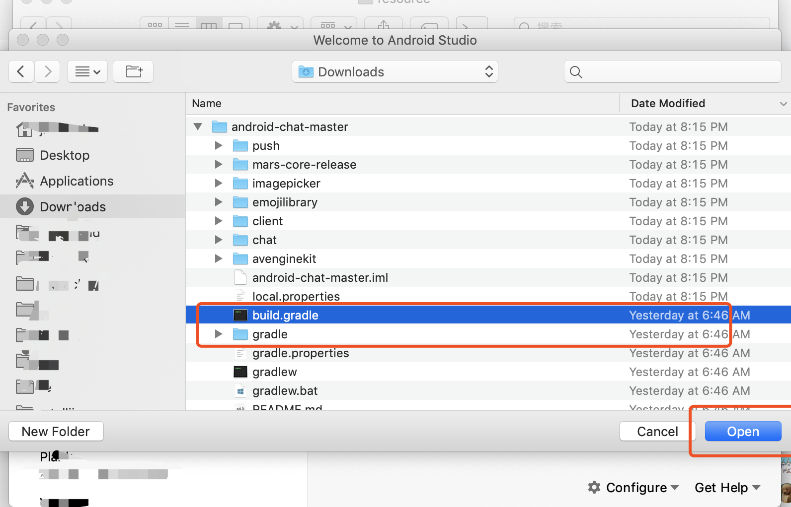

#### Q. 如何导入Android Studio？

1. Android开发中，经常需要下载一些依赖，需自行解决网络问题，保证通常的网络环境

2. 本项目基于最新版本的Android Studio开发，未测试旧版本兼容性，请先将Android Studio升级到最新版本

3. 从[GitHub](<https://github.com/wildfirechat/android-chat>)下载最新代码

4. 打开Android Studio，选择```Open an existing Android Studio project```

   

5. 选择所下代码**根目录下的build.gradle**，点击open

   

6. 导入成功之后，如下

   

   