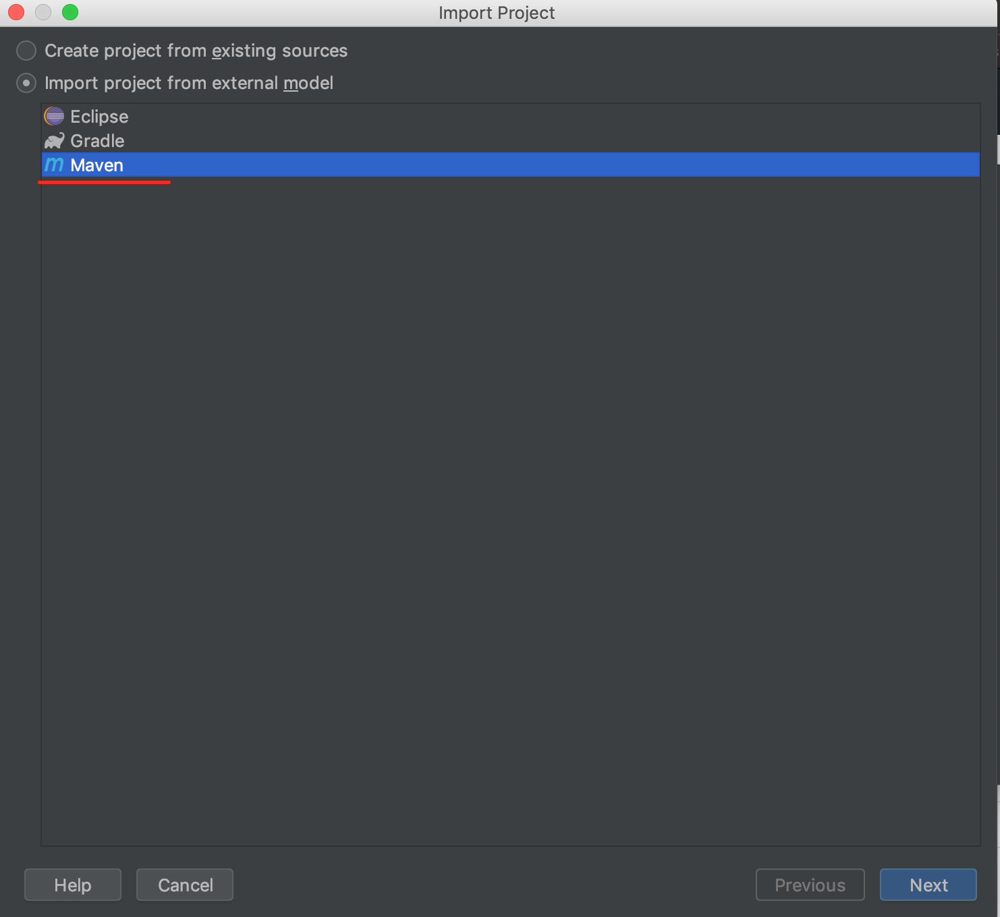
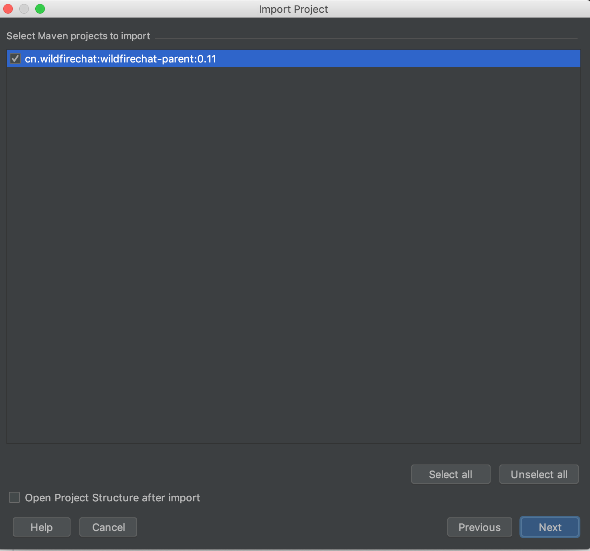
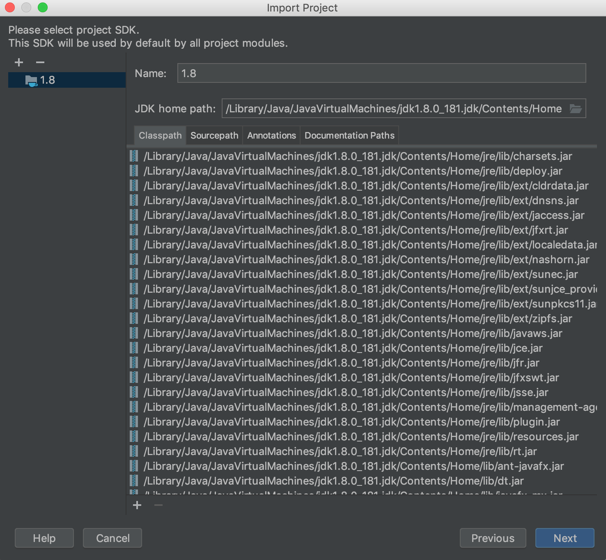
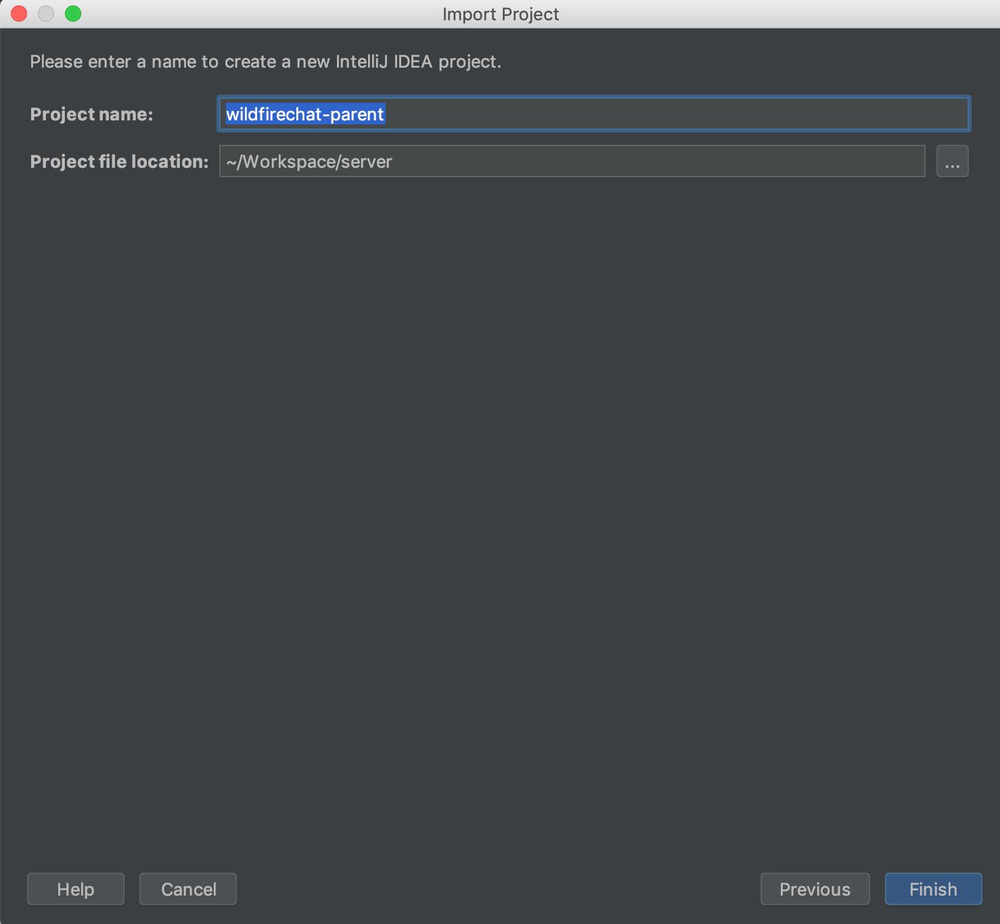
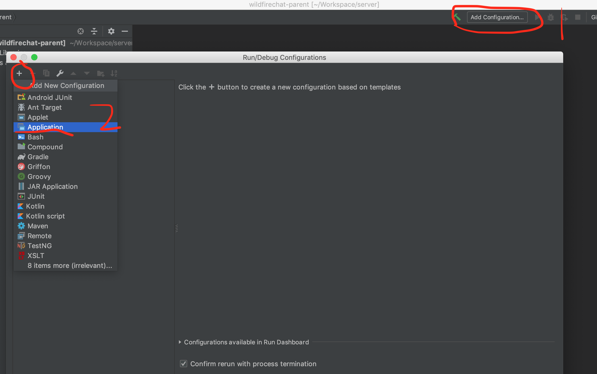
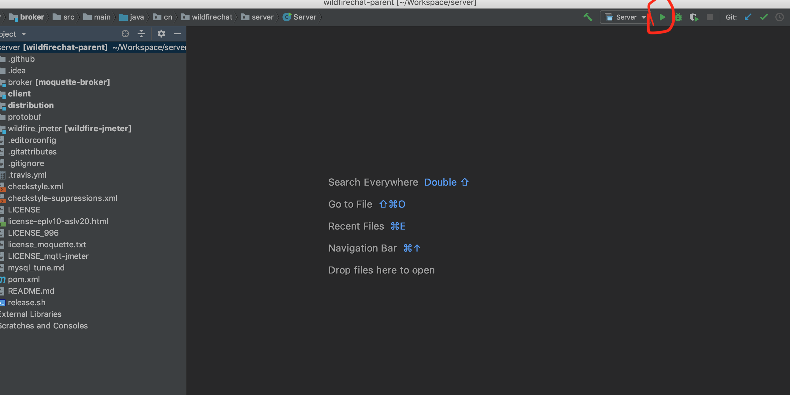

#### Q. 如何把IM服务倒入到IDE中？
A. 这里讲一下如何倒入到IDEA中并运行，eclipse或其它IDE请参考IDEA自行解决。
首先确保IDEA配置正确，JDK及maven都正确安装。然后在[github](https://github.com/wildfirechat/server/releases)上下载下来最新代码，并解压。

打开IDEA，选择"Import Project"

选择“maven”，然后下一步

下一步

下一步

下一步

下一步

点"Finish"

点完结束之后，maven会自动下载依赖包，需要耐心等待一段时间，如果依赖包下载不下来，需要考虑更换国内的源，更换方法请自行百度。

依赖包下载完毕后，点"Add Configuration"，然后点“+”，再选择"Application".

分别填入服务名称， Main class选择"cn.wildfirechat.server.Server"，Working directory选择到"broker"目录，Classpath of module选择"moquette-broker"。 ***这里一定要选择对***

点击红圈的运行或旁边的调试按钮来运行。

***特别提示：请不要在IM服务内部进行二次开发，因为一旦修改将失去使用专业版的可能性，另外我们不对修改过的版本提供支持服务，您不得不自己独立维护自己的版本。可以使用IM服务的server api及自定义消息进行集成和二次开发，如果只有修改代码才能完成，可以给我们提需求由我们来完成。***
