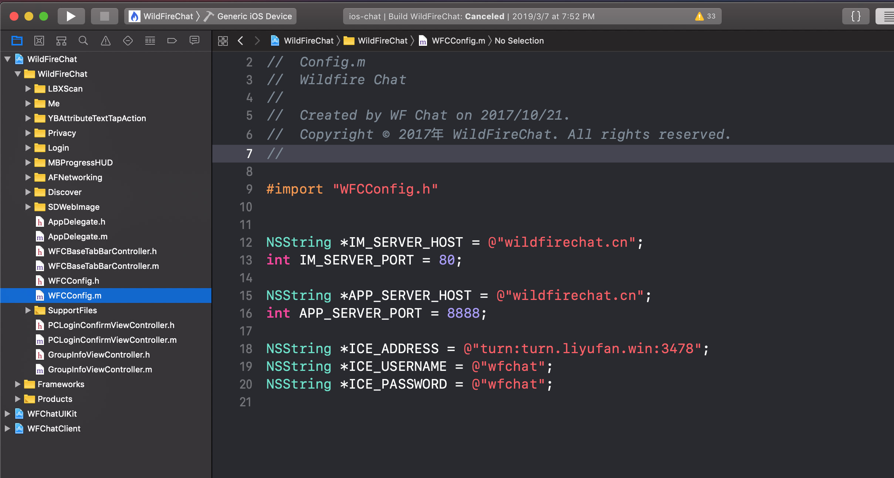
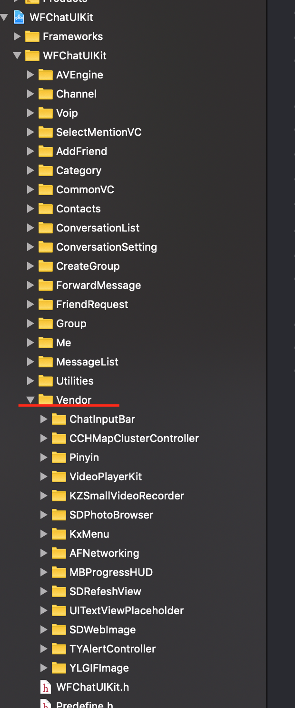

# 代码编译与工程说明
由于服务器是私有部署，因此必须修改服务器地址然后编译。下载[源码](https://github.com/wildfirechat/ios-chat)，然后用xcode打开```ios-chat.xcworkspace```

#### 修改服务器地址
如下图，修改IM服务host和port，修改app服务host和port。测试体验时可以使用我们提供的turn服务，上线时，请自己使用自己部署的turn服务。


#### 工程说明
如上图所示，有3个工程。
1. WFChatClient 功能SDK，负责实现所有的功能，不包括UI。ChatClient依赖于[协议栈](https://github.com/wildfirechat/proto)，您也可以自己编译替换协议栈。这个工程和协议栈的维护一般是我们来进行，建议遇到问题给我们提issue。如果是IM的通用需求，我们会尽最大努力满足。
2. WFChatUIKit UI SDK，负责常用IM UI界面。客户可以集成使用，快速开发，降低开发成本。如果不能满足您的需求，也可以抛弃ChatUIKit，自己基于ChatClient来开发自己的UI。建议这个工程有客户多多参与，如果有通用问题，请提Push Request或者issue。
3. WildFireChat 示例应用。使用了ChatUIKit和ChatClient，演示如何使用我们的SDK。

#### 依赖库(二进制)
1. libopencore-amrnb.a wav与amr格式的转换工具。
2. mars.framework 我们二次开发的协议栈，开源的，客户可以自主编译。
3. WebRTC.framework 谷歌正式发布的WebRTC库
4. WFAVEngineKit.framework 基于野火IM实现的信令系统，只支持一对一音视频功能。由于是购买的商业代码，无法开源，但可以协议转让源码。如果不需要音视频功能，可以去掉该库及相关UI。

#### 依赖库(源码)
ChatUIKit使用了许多优秀的开源库，都来源于github，放置于```vendor```目录下，客户集成时，需要避免冲突

