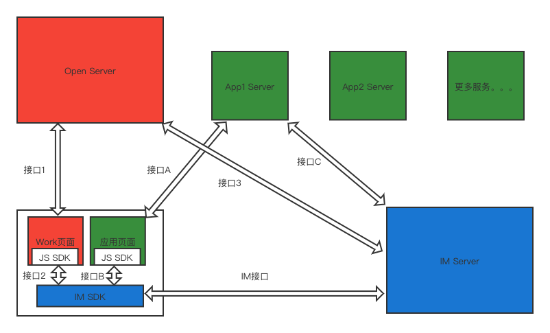
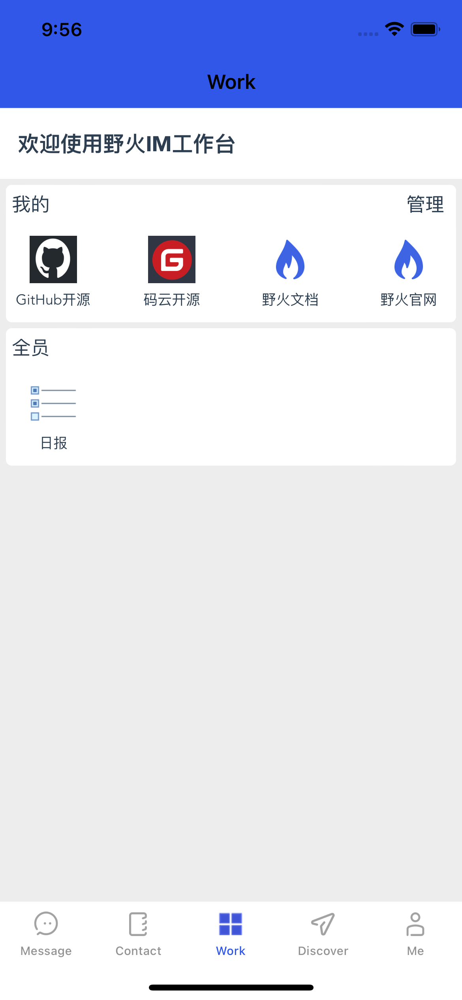

# 概述
野火开放平台系统包括3个部分，分别是IM系统、开放平台和应用。IM系统只是即时通讯的功能，在企业应用中需要对接大量的第三方办公类服务，比如考勤、打卡、文档、会议等，这些服务就是开放平台系统中的应用。需要一个服务来管理他们，方便他们的对接IM服务，这个服务就是开放平台。

IM系统和开放平台都部署在客户的私有网络中。野火不提供应用，所有应用都应该由客户自己开发（或者现有系统对接）或者第三方服务提供商来开发（或对接现有系统），应用可以部署在客户自己的内网中，或者部署在第三方服务云平台中。

## 架构图

图上红色部分为开放平台；绿色部分为应用，可能会有很多个应用，图上以应用1来举例；蓝色部分为IM系统。

## 工作台
客户端提供一个工作台入口，让用户来使用应用，野火在各个平台都支持工作台，下面是iOS端的展示，其他端也都类似：

工作台展示当前用户收藏的普通应用和全局应用。当前用户可以收藏或者取消收藏应用。用户可以点击图标打开第三方应用。

## 应用类型
常见应用开放平台都会区分应用类型，分别是自建应用和第三方应用。区别就是权限的不同，自建应用拥有更大的权限。在野火开放平台系统中没有做这种区分，应用都是以现有机器人接口和频道接口来调用IM服务，这些接口是可以开放给第三方应用的。如果自建应用需要更高的权限，可以使用野火管理API。

## 前端开发方式
应用最方便的接入方式就是H5网页，用户通过访问网页来使用应用提供的服务。如果使用原生代码就需要侵入到客户端的代码，开发和维护都比较困难，建议应用的前端都以H5来开发。

## 应用与IM的依赖关系
常见的关系有以下几种：
1. 单纯的网页，无交互。这种应用只在工作台中有个图标，点击打开网页，与IM系统没有任何交互。
2. 标准应用，需要认证当前用户，调用IM的原生能力选取用户、选择图片、发送消息等。需要前端引入野火JSSDK来与IM交互。
3. 后台服务，无页面。这种应用只通过机器人API或者频道API与用户交互，不提供工作台页面。这种情况不需要在开放平台中添加，只需要通过管理API开通机器人或者频道账户就行了。

## 开放源码
开放平台源码 [https://github.com/wildfirechat/open](https://github.com/wildfirechat/open)。

JSSDK在开放平台源码中 [源码目录中](https://github.com/wildfirechat/open/tree/main/open-work/src/jssdk)

客户端浏览器代码在对应各个平台的开源项目中。

IM服务SDK在 [服务SDK](https://github.com/wildfirechat/im-server/tree/wildfirechat/sdk)
