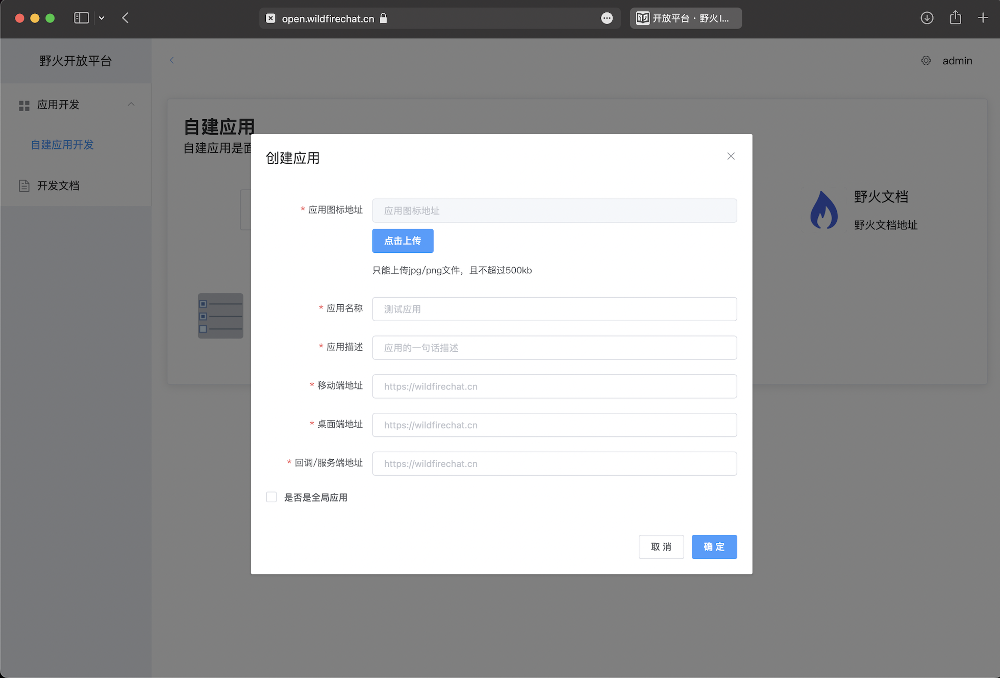
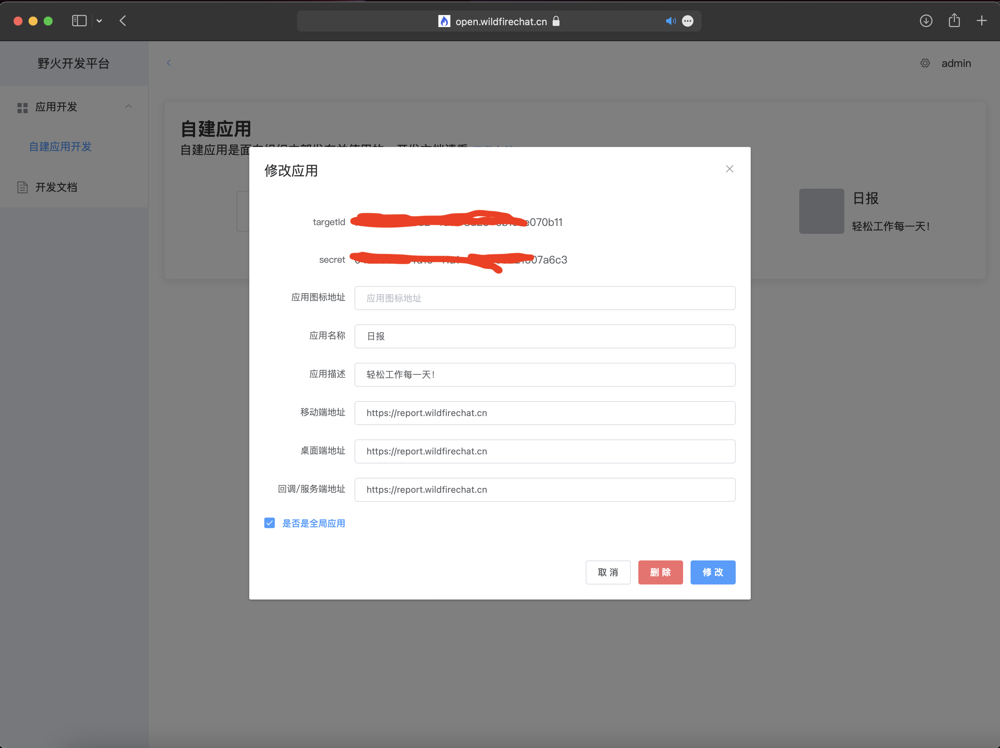

# 应用接入流程

## 创建应用
在开放平台管理页面，点击添加应用，填入对应的信息，如下图所示：

回调/服务端地址有2个作用，一个是当用户通过机器人或者频道回复消息时，会回调到这个地址。另外一个是为了验证网页的合法性，调用jssdk会验证网页的host是否跟这个地址的host一致，如果不一致则jssdk调用失败。

全局应用会出现在所有用户的全局应用列表中，如果非全局应用，用户可以收藏/取消收藏普通应用。

## 获取到ApplicationId和Secret
点击查看建立的应用，如下图:

图中红色覆盖的就是应用id和密钥。

## 集成野火服务端SDK
野火服务端SDK包括管理API、机器人API和频道API。每个应用都会有一个机器人账户和一个频道账户，ID和密钥就是应用ID和密钥。初始化机器人API和频道API后就可以在后端与IM服务进行交互。

服务端SDK是Java语言的，如果您是其它语言，可以参考[机器人API](../server/robot_api/README.md)和[频道API](../server/channel_api/README.md)来自行开发。

## 前端集成
前端H5页面引入[JSSDK](https://github.com/wildfirechat/open/tree/main/open-work/src/jssdk)，通过getAuthCode来认证当前用户，通过config来获得应用的认证。之后进行正常的业务服务。

## 认证方式
一般开放平台都有2中方式，一种是JSSDK认证方式，这就需要页面运行在客户端内部的浏览器中；另外一种是OAuth协议，这种页面运行在非客户端的浏览器中。野火开放平台只提供JSSDK认证方式，如果需要OAuth方式，请自行添加这种方式。
