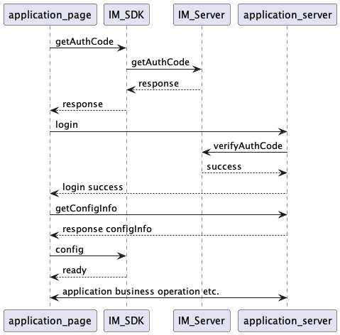

# 认证
页面需要安全机制确保信息安全，认证包括2部分，一部分是前端页面识别出当前用户，防止出现假冒或者错误的情况；另外一部分是客户端对页面进行认证，仅允许经过认证的页面来调用SDK，防止非认证的页面来窃取信息。

## 流程

应用前端页面与IM SDK的交互是通过JSSDK进行的。应用后端是通过机器人API和频道API调用IM服务，IM服务收到消息会回调到应用回调地址。

config时，IM SDK会把当前页面的host和签名信息一起传到IM服务，IM服务跟判断页面host是否与应用回调/服务地址的host一致，如果不一致则config失败。

## AuthCode
前端页面识别当前用户是通过AuthCode进行的。流程如下：
1. 页面通过JSSDK调用IM SDK的getAuthCode接口。
2. IM SDK调用IM服务的getAuthCode，调用成功返回authCode。
3. SDK回调AuthCode给前端页面。
4. 前端页面调用登录接口，登录信息中包含AuthCode。
5. 应用后端在登录方法中拿到AuthCode，调用IM服务验证AuthCode。
6. IM服务验证AuthCode成功后，返回该用户的用户ID。
7. 应用服务获取用户ID，确认登录成功，返回用户信息给前端页面。
8. 前端页面登录成功，得到了当前用户的用户信息。
> authCode的有效期是5分钟，所以拿到authCode后请尽快验证，另外确保所有服务的时间同步。

## config
SDK认证当前页面是通过config方法进行的，流程如下：
1. 页面调用应用后端获取Config签名信息。
2. 应用后端调用SDK生产签名信息。
3. 页面通过JSSDK调用IMSDK的config函数，原生代码层会自动加上当前页面host信息。
4. IMSDK调用config函数，IM服务收到签名信息和host。
5. IM判断host是否正确，验证签名，成功后返回客户端。
6. IMSDK收到成功的回调后，记录config状态，通过ready方法通知页面。
7. 页面收到ready通知后，就可以通过JSSDK调用其它方法，IM SDK根据config记录情况判断是否允许调用。
