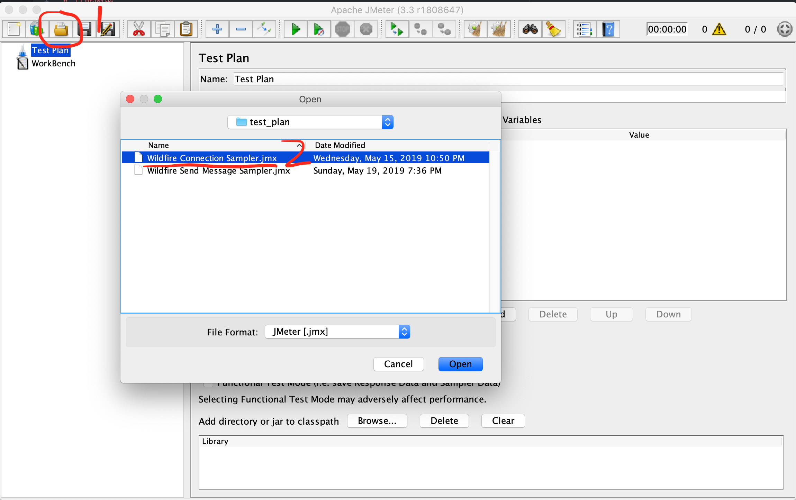
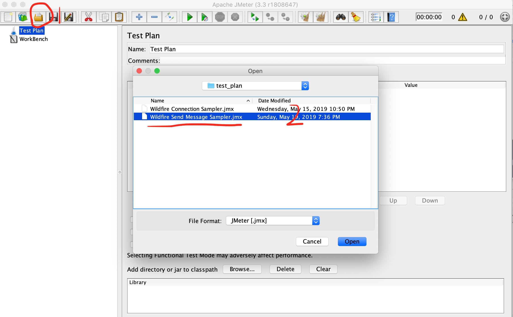
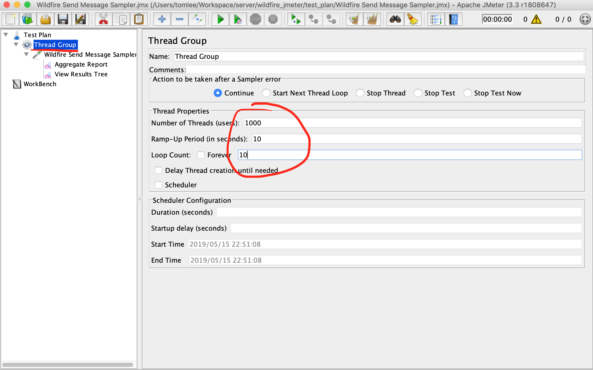
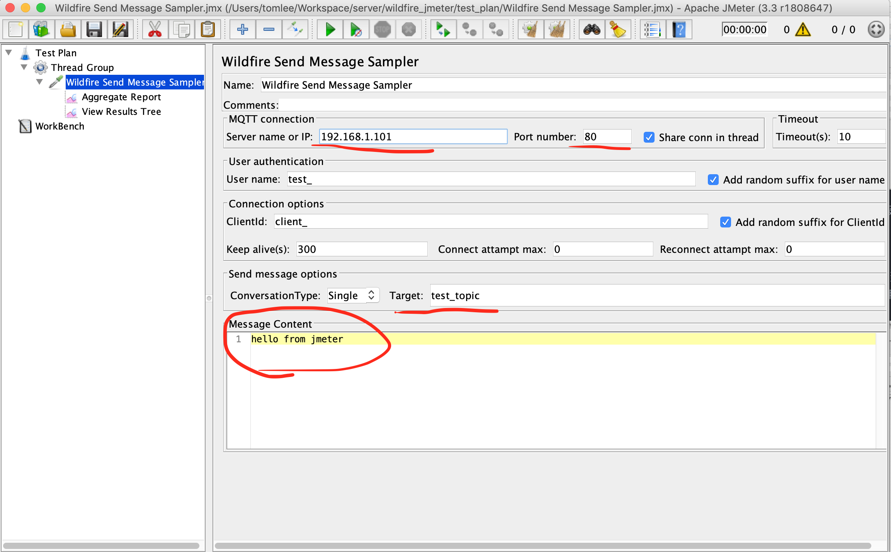
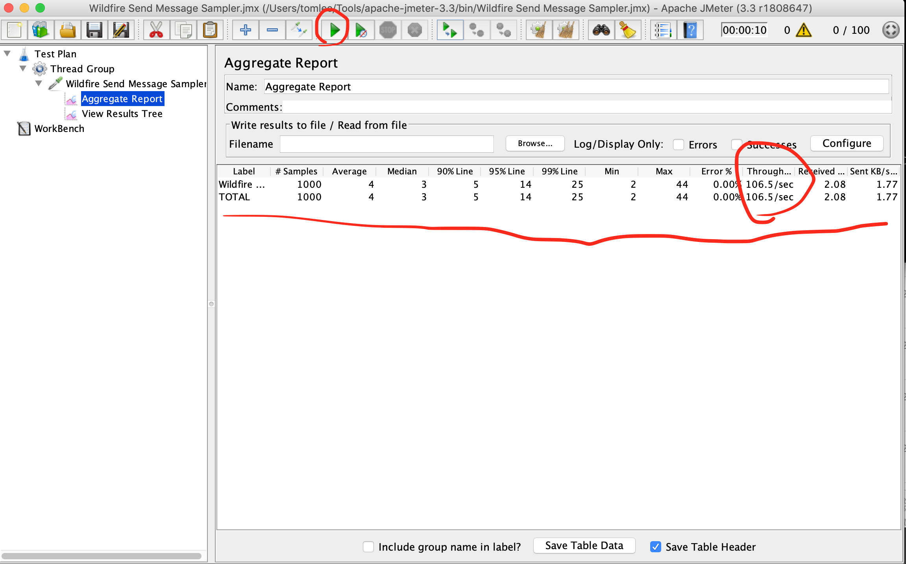

# 性能测试
1. 修改最大文件打开数（ulimit），修改方法请用百度查。
2. 单独部署db，并对配置进行优化。
3. 部署IM服务和应用服务，部署到同一台服务器上，注意使用默认的key和默认的端口。
4. 使用客户端登录，验证服务器是否部署成功。
5. 下载jmeter3.3版本(其它版本未经过验证)。把发布包中的```tools/jmeter/*.jar```放到```/jmeter_path/lib/ext```。也可以编译社区版源码中的插件代码。
6. 使用jmeter打开```tools/jmeter/```目录下的连接数(```Wildfire Connection Sampler.jmx```)和发送消息脚本(```Wildfire Send Message Sampler.jmx```)进行测试。注意每台打压机最多只能拥有6W个长连接，进行连接数测试时需要使用jmeter集群模式，或者多台测试机器同时开始，以便能够达到理想的测试结果。打压机也不要和火信服务器放到一起，以免结果出现偏差。
> 测试工具还是不够完善，如果遇到问题，可以尝试关闭测试程序重新打开。

## 测试连接数
1. jmeter工具，选择打开按钮，选择```Wildfire Connection Sampler.jmx```脚本


2. 选择线程组（Thread Group），然后填写连接数（Number of Threads）和发起时间（Ramp-Up Period）。由于建立连接需要时间，可以按照每秒100个的速度建立连接，比如你要实现1W个连接，时间可以填写100.


3. 选择连接测试计划（Wildfire Connection Sampler），设置IM服务器地址和端口。应用服务器测试程序会自动利用IM服务器和8888端口。


4. 点击开始按钮执行测试计划，观察右上角的连接数。在连接数达到预期后等待30分钟，期间可以抓pcap包观察心跳情况，在保持30分钟后，使用linux命令查看1883端口连接情况（具体指令请百度）。


## 测试发送消息
1. jmeter工具，选择打开按钮，选择```Wildfire Send Message Sampler.jmx```脚本


2. 选择线程组（Thread Group），然后填写线程数（Number of Threads）、发起时间（Ramp-Up Period）和循环数(Loop Count)。消息条数就是循环数*线程数


3. 选择发送消息计划（Wildfire Send Message Sampler），设置IM服务器地址和端口。应用服务器测试程序会自动利用IM服务器和8888端口。设置接收者，设置消息内容。


4. 点击开始按钮执行测试计划，查看系统吞吐率。

