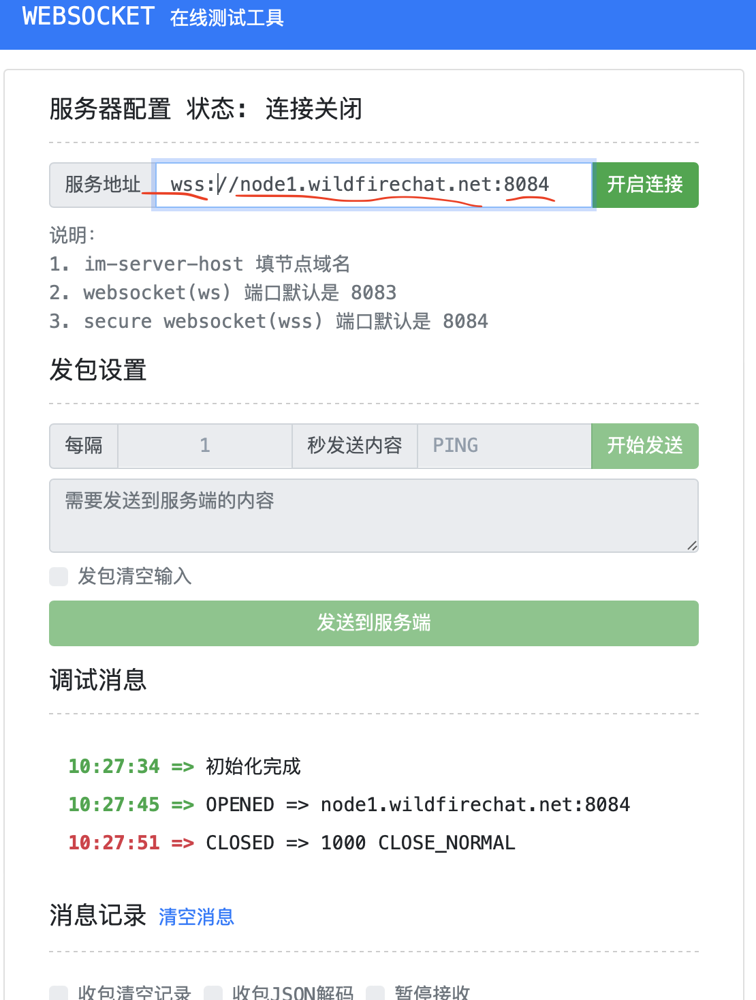

# Web客户端配置
这里讲一下Web/小程序客户端的配置和背景知识。因为web和小程序都是同样的接口，下面只说web的情况，小程序也是一样的。

## Web客户端的一些基础知识
Web客户端与IM服务的交互有2部分，一部分是HTTP的访问，是做类似于服务发现的功能，访问任意一个IM服务的HTTP端口，得到自己的长连接信息；另一部分是Websocket的长连接，这个长连接会固定连接到它被分配的服务节点，长连接建立后所有的IM业务都是通过长连接进行。

浏览器有个特性，如果部署在HTTPS站点，那么这两个交互都必须是SSL/TLS的。如果部署在HTTP站点，那么这两个交互可以是SSL/TLS也可以不是。

在Web客户端的配置文件```config.js```中，有个```USE_WSS```开关。这个开关是告诉协议栈这两种请求是走SSL/TLS的，还是非SSL/TLS的。只能同时开启或同时关闭，没有办法一个走SSL/TLS，另外一个不走SSL/TLS。

根据浏览器的特性，如果部署在HTTPS站点，那么```USE_WSS```一定要为```true```，那么IM服务一定要提供HTTPS和WSS的支持。

如果需要使用音视频通话，根据WebRTC的安全性要求，只有本地和HTTPS才可以使用WebRTC。因此如果有音视频通话要求，则必须使用SSL/TLS。

一般情况下，只有部分单位内外网隔离的才不用SSL/TLS，其他客户都需要使用SSL/TLS。

## IM服务开启对web客户端的支持
默认IM服务默认没有开启对Web客户端的支持，关于开启的说明，请服务端同事参考专业版IM服务部署文档和[IM服务Web配置](./im_server_config.md)。

## IM服务能力支持检查
在web客户端开始工作之前需要先确认IM服务是否对开启了web客户端的支持。首先确认是否要支持SSL/TLS，

检查有2步，第一步是检查HTTP（S）是否正常，第二步是检查WS(S)是否正常。下面分成支持SSL/TLS和不支持SSL/TLS两种情况。

### 不支持SSL/TLS的情况
1. 检查HTTP功能：在浏览器中输入 http://{授权地址}/api/version 看一下是否能够返回IM服务的JSON信息。
2. 检查WS功能：向服务器同事要一下这几个信息：部署了几个节点及每个节点配置的```server.ip```和```websocket_port```，然后通过[这个在线工具](http://docs.wildfirechat.cn/web/wstool/index.html)验证WS是否成功配置。

  > 如果Websocket检查失败，请让服务同事确认端口```websocket_port```是否打开。

### 支持SSL/TLS的情况
1. 检查HTTPS功能：在浏览器中输入 https://{授权地址}:{https端口}/api/version 看一下是否能够返回IM服务的JSON信息。
2. 检查WSS功能：向服务器同事要一下这几个信息：部署了几个节点及每个节点配置的```server.ip```和```secure_websocket_port```，然后通过[这个在线工具](http://docs.wildfirechat.cn/web/wstool/index.html)验证WSS是否成功配置。

  > 如果Websocket检查失败，请让服务同事确认端口```secure_websocket_port```是否打开，及证书是否正确配置。

### WS(S)在线工具的使用
可以通过在线工具验证WS(S)是否支持，打开以后界面如下：

服务地址分三部分。第一个是schema，如果不支持SSL/TLS，就应该是```ws```，如果支持就应该是```wss```；第二部分就是地址，注意这个地址是IM服务配置文件中的```server.ip```的地址，不是授权地址；第三部分是端口，也在IM服务配置文件中，如果是SSL/TLS，端口为```secure_websocket_port```，如果不是，端口为```websocket_port```。

填写服务地址后，点***开启连接***，查看调试消息，如图上：```初始化完成```和```OPENED```就说明服务支持了WS(S)功能。等到几秒中后，IM服务会断开连接，这时正常的。

## 应用服务
如果要是支持HTTPS站点，应用服务也需要HTTPS的支持，联系负责服务端的同事，对应用服务提供HTTPS支持。

## 最终配置
如果要支持HTTPS站点，参考配置如下
```
static USE_WSS = true;

//HTTPS端口，如果使用其他端口请注意修改
static ROUTE_PORT = 443;

//应用服务HTTPS地址，请改为您的应用服务HTTPS的地址。
static APP_SERVER = 'https://app.wildfirechat.net';
```

如果要不支持HTTPS站点，参考配置如下
```
static USE_WSS = false;

//HTTP端口
static ROUTE_PORT = 80;

//应用服务HTTP地址，请改为您的应用服务HTTP的地址。
static APP_SERVER = 'http://wildfirechat.net:8888';
```
