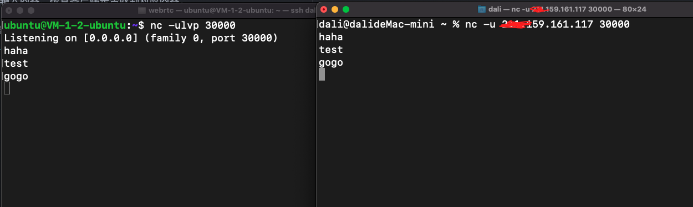

# UDP端口连通性检查
Turn服务或者Janus服务都需要随机绑定UDP端口供客户端进行使用，因此必须确保防火墙开放UPD端口，本文将要介绍如何检查服务器的UDP端口是否打开，这里使用[netcat](https://www.baidu.com/s?wd=netcat)来检查他们之间的连通性：
1. 环境准备: 需要在客户端网络之内准备一台linux或者mac作为测试客户端；在测试客户端和服务器上分别安装```netcat```，已知Ubuntu和mac已经预安装了，centos可以用命令```yum install -y nc```来安装。其它系统可以百度怎么安装。
2. 在服务器上，执行命令 ```nc -ulvp 30000```。30000为监听UDP端口，需要注意服务器配置的端口范围之内。
3. 在客户端上执行命令 ```nc -u YOUR_PUBLIC_IP 30000```。```YOUR_PUBLIC_IP```是服务器的公网IP，也是启动命令内的参数。
4. 在客户端输入内容，检查服务器端是否收到对应内容。
5. 服务器端收到后，在服务器端窗口输入内容，检查客户端是否收到对应内容。

正确情况如下图所示：左侧为服务器端，先启动服务器端，再启动右侧的客户端，双方能够互相收发就表面udp端口是通的。


如果失败说明网络之间不通，需要运维检查网络环境。如果成功，客户端需要断开，再重试几次。再更换服务器端端口，重复测试几次。

UDP检查方案来源于[这里](https://docs.azure.cn/zh-cn/articles/azure-operations-guide/virtual-network/aog-virtual-network-using-netcat-check-the-connectivity#测试-udp-端口连通性)。如果有其它方案也可以自行使用。
